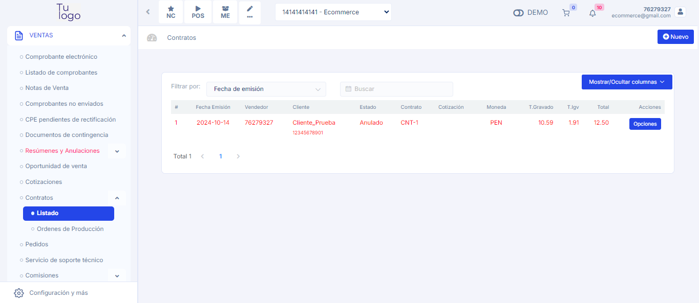

# Anulación de Contratos  

## Descripción  
Se corrigió el error que impedía la anulación de contratos. Ahora, los contratos en estado **"Registrado"** pueden ser anulados correctamente, y el estado se actualiza de inmediato a **"Anulado"** en la base de datos.  

Este ajuste garantiza que solo los contratos elegibles sean procesados y evita inconsistencias en el sistema. Además, los usuarios pueden visualizar el cambio de estado al instante sin necesidad de refrescar manualmente la vista.

 