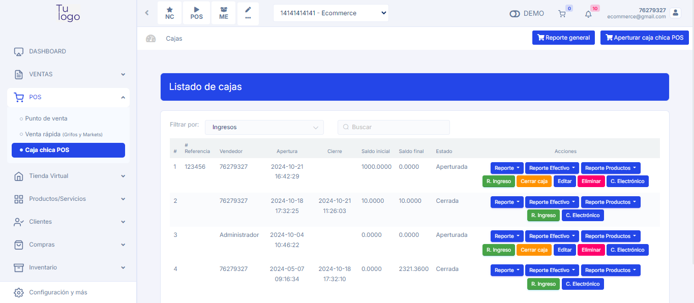

# Unificación de Cajas: 

**Mayor Eficiencia en Gestión de Pedidos**

Se ha unificado las cajas de **Punto de Venta (POS) y mesas de restaurant** para optimizar la gestión de pedidos y pagos. Esta integración permite:

- Mayor eficiencia en la toma de pedidos y pagos 
- Reducción de errores y tiempos de espera
- Mejora en la experiencia del cliente

Ahora, todos los pedidos se gestionan desde una sola vista, simplificando el proceso y mejorando la productividad.

Para más detalles sobre cómo hacer la configuración, puedes consultar la ducumentacion para mayor información:
**[Articulo](https://fastura.github.io/documentacion/pos/Abrir-una-caja-y-exportar-reportes)**
