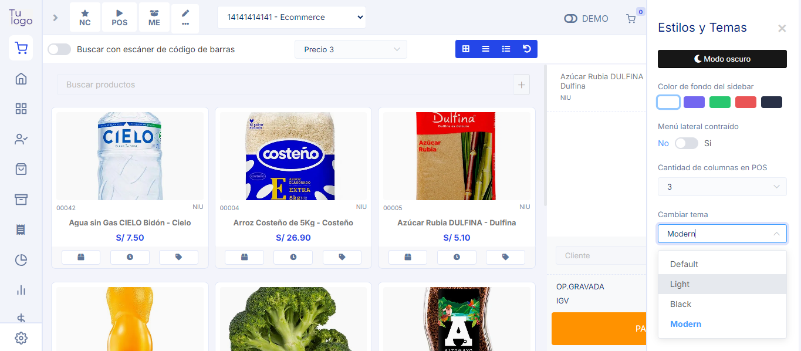

# Mejora del POS para el Tema Modern

## Descripción  
Se realizaron mejoras específicas en el **POS** para alinearlo con el **tema Modern**, optimizando tanto su diseño visual como la experiencia del usuario. Estas modificaciones buscan mantener coherencia con las nuevas tendencias estéticas y de usabilidad, mejorando la eficiencia operativa y la satisfacción del usuario.

## Motivo del Cambio  
- **Alineación estética:** Adaptar el POS al tema Modern para mantener una apariencia coherente en todas las plataformas.  
- **Mejora en la experiencia de usuario:** Facilitar la navegación y el acceso a funciones clave mediante un diseño más intuitivo.  
- **Optimización del rendimiento:** Modernizar el código y los componentes para mejorar la velocidad y estabilidad del sistema.

## Impacto  
- **Consistencia visual:** Mejora la percepción del sistema al integrar la estética moderna.  
- **Eficiencia operativa:** Menor tiempo de aprendizaje para nuevos usuarios.  
- **Aumento de satisfacción:** Interfaz más atractiva y funcional.

