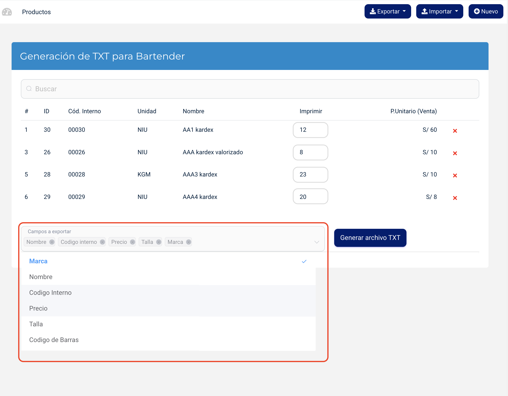

# Exportación de productos para Bartender

## Descripción

Se ha añadido una opción para exportar los productos en formato **TXT** compatible con **Bartender**, lo que facilita la integración con sistemas de impresión de etiquetas.

- **Exportación de productos a Bartender**: Ahora es posible seleccionar los productos y exportarlos como un archivo **TXT** con los campos configurables, que puede ser utilizado directamente en el software Bartender.

## Beneficios

- **Facilidad de integración**: Permite una integración directa con el sistema Bartender, optimizando el proceso de impresión de etiquetas.

- **Personalización**: Los usuarios pueden elegir qué campos exportar, como el código interno, descripción, precio, talla, color, entre otros.

- **Mayor eficiencia**: La exportación automática reduce el tiempo y el esfuerzo necesarios para generar etiquetas de productos.

## Funcionalidad

- **Selección de columnas**: El usuario puede seleccionar las columnas a exportar (como código, nombre, precio, etc.) antes de generar el archivo.

- **Generación de archivo TXT**: Al hacer clic en la opción de exportación, el sistema genera un archivo **TXT** con los productos seleccionados y los campos configurados para Bartender.
