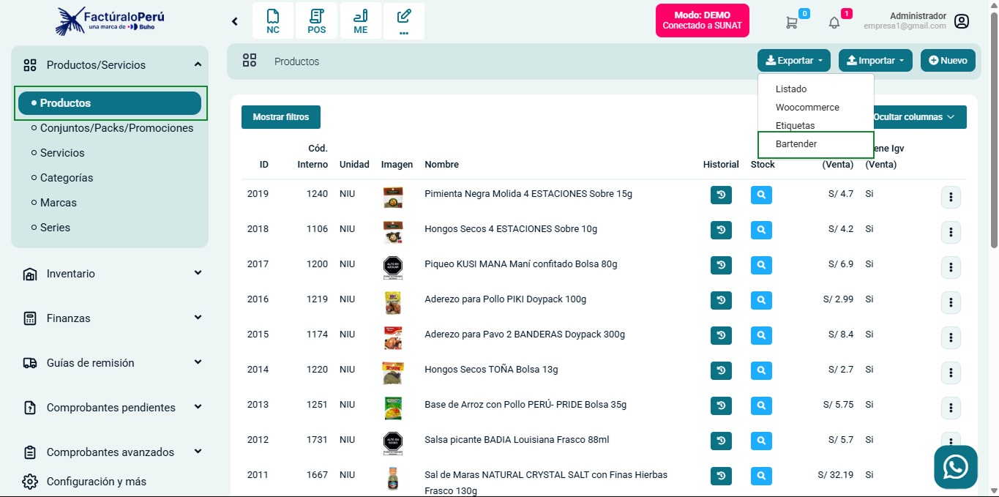

# Incorporación de opción para exportar a Bartender

Se añadió una opción que permite descargar archivos en formato TXT, diseñados para integrarse con el programa Bartender. Esta funcionalidad facilita la creación de etiquetas, mejorando la eficiencia en la gestión de etiquetado y personalización.

