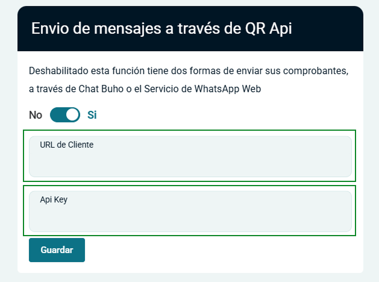

# Incorporación de botón de WhatsApp QRApi de manera Global

Se añadió un botón de WhatsApp QRApi en varias secciones del sistema de facturación (Nota de Venta, Cotización, Punto de Venta, Guía de Remisión y Transportista). Este botón permite enviar los documentos PDF generados directamente a través de WhatsApp, mejorando la eficiencia en la comunicación con los clientes.

