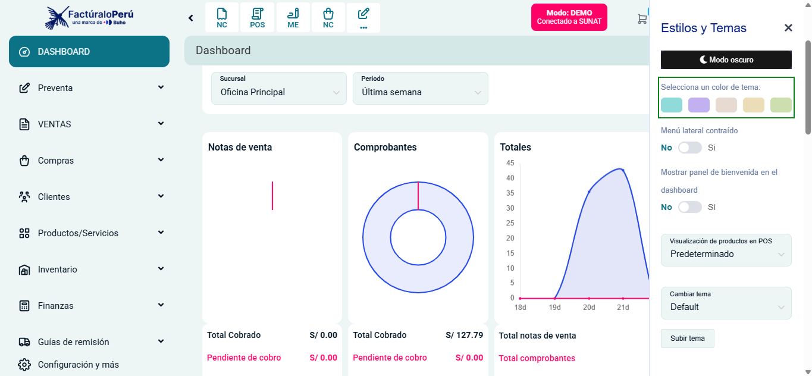

# Selector de Color de Tema  

Se ha agregado un **Selector de Color de Tema** en la configuración de estilos y temas del sistema.  

## **¿Qué incluye esta nueva funcionalidad?**  
- Ahora los usuarios pueden personalizar la interfaz seleccionando entre diferentes colores de tema.  
- Se encuentra disponible en la sección **"Estilos y Temas"** dentro de la configuración.  
- Permite una experiencia más adaptable a las preferencias de cada usuario.  

Esta mejora brinda mayor personalización y flexibilidad en la apariencia del sistema. 🚀  

