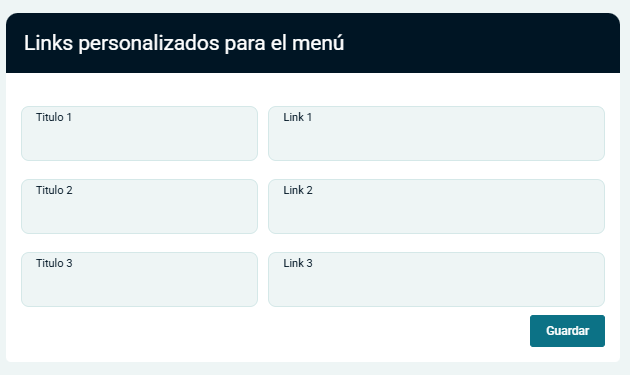
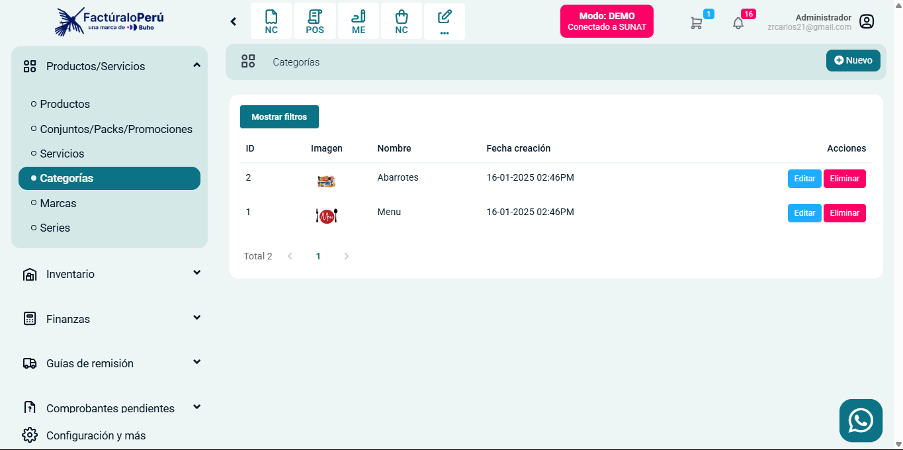
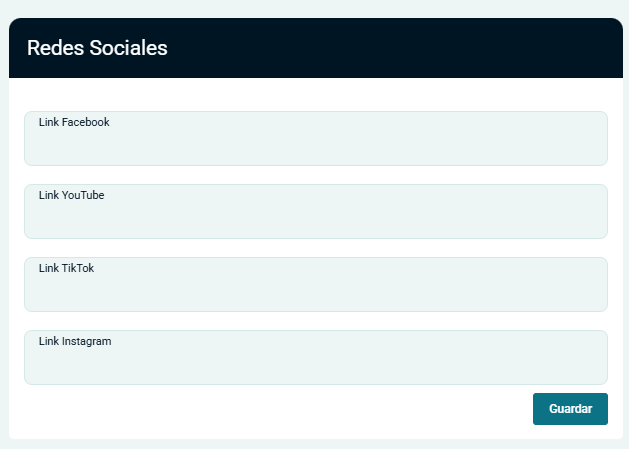

# Config. Tienda y Restaurante

**1. Unificación de Configuraciones**
Se han integrado las configuraciones de Tienda Virtual y Restaurante en una sola sección dentro de "Configuración de Empresa" en la pestaña "Avanzado". Esto permite una gestión centralizada de ambas funcionalidades en un mismo lugar.

**2. Cambio de URL**
- Se ha cambiado la URL del menú de **Restaurante** a **pedidos**.
- Esta modificación busca mejorar la navegación y facilitar el acceso a las funcionalidades relacionadas con la administración de pedidos.

**3. Links Personalizados para el Menú**
- Se ha agregado una nueva opción para configurar links personalizados en el menú.
- Los usuarios ahora pueden definir títulos y URLs personalizadas para hasta tres enlaces en el menú de la tienda.

**4. Imagen en el Listado de Categorías**
- Se ha añadido una nueva funcionalidad que permite visualizar una imagen representativa de cada categoría en el listado.
- Esto mejora la experiencia del usuario al navegar por las categorías de productos o servicios.

**5. Redes Sociales**
- Se ha eliminado Twitter de las opciones de configuración de redes sociales.
- Se ha agregado TikTok en su lugar, permitiendo a los usuarios enlazar su cuenta de TikTok directamente desde la configuración.

