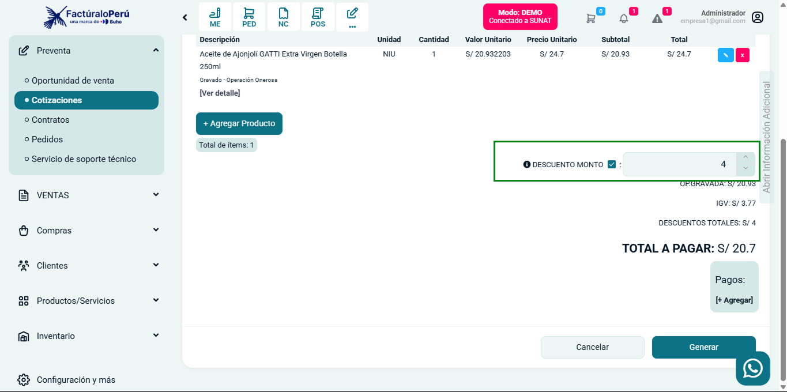

# Descuento Global en Cotizaciones

### Descripción
Se ha implementado la funcionalidad de **Descuento Global** en la sección de Cotizaciones dentro del sistema. Ahora los usuarios pueden aplicar un descuento en monto sobre el total de la cotización.

### Ubicación en el Sistema
- Módulo: **Preventa**
- Submódulo: **Cotizaciones**

### Características Principales
1. **Habilitación del Descuento Global**
   - Se añade una opción para habilitar/deshabilitar el descuento global.
   - Se usa un **checkbox** para activar o desactivar la funcionalidad.

2. **Aplicación del Descuento**
   - Se introduce un campo de entrada donde el usuario puede ingresar el monto del descuento.
   - Al ingresar el valor, se actualiza automáticamente el **Total a Pagar**, descontando el monto especificado.
   - Se refleja el descuento aplicado en el resumen de la cotización.

3. **Cálculo del Total**
   - El subtotal de la cotización se mantiene sin cambios.
   - Se muestra el **descuento total aplicado**.
   - El sistema recalcula automáticamente el **Total a Pagar** restando el descuento global.

### Validaciones Implementadas
- El monto de descuento no puede ser mayor al subtotal de la cotización.
- Se restringe el ingreso de valores negativos o caracteres no numéricos.
- Si el usuario desactiva la opción de descuento, el campo de monto se deshabilita y el total se recalcula sin descuento.

### Beneficios
- Facilita la gestión de descuentos en cotizaciones sin necesidad de aplicar descuentos por producto.
- Proporciona mayor flexibilidad en la negociación con clientes.
- Mejora la experiencia del usuario al ofrecer un cálculo automatizado y transparente del total.

