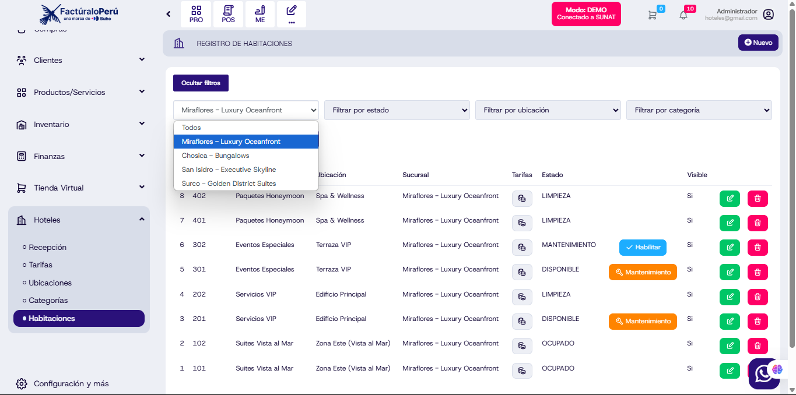

# Multihotel por Sucursal  

## Descripción  
Cada sucursal contará con sus habitaciones por separado, permitiendo administrar cada hotel de manera independiente.  

## Funcionalidades Clave  
- **Filtrado por Sucursal**: En el módulo de habitaciones, se podrá seleccionar la sucursal deseada, mostrando únicamente las habitaciones correspondientes.  
- **Gestión Independiente**: Cada sucursal tendrá sus propias configuraciones de habitaciones, incluyendo tarifas, estados y visibilidad.  
- **Vista General de Recepción**: La vista de recepción permitirá seleccionar la sucursal y mostrar el estado de ocupación de las habitaciones de esa sede.  
- **Asignación de Habitaciones por Sucursal**: Al registrar una habitación, se deberá seleccionar a qué sucursal pertenece.  

## Beneficios  
- Mejora la organización y administración de múltiples hoteles.  
- Permite un control más preciso de las habitaciones disponibles en cada sucursal.  
- Facilita la gestión independiente de cada sede sin interferencias.  
- Solo el **Administrador** podra ver las habitaciones por surcusales.

