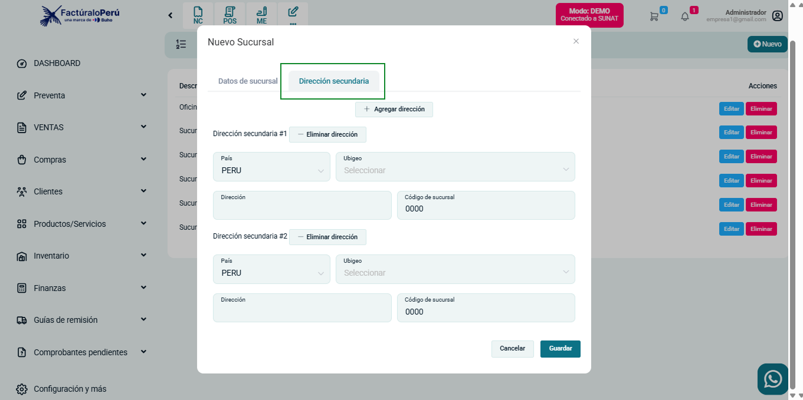

# Incorporación de direcciones adicionales en el módulo de Surcusales y Series

Se añadió la funcionalidad para gestionar direcciones adicionales directamente desde el módulo de **Surcusales y Series**. Esto permite una mayor flexibilidad en la configuración de ubicaciones asociadas y mejora la organización de información logística.

