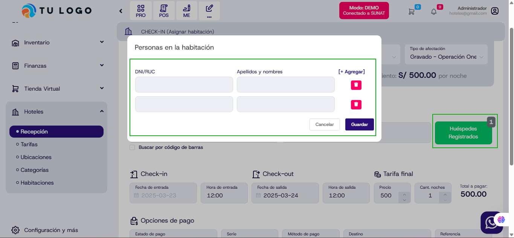
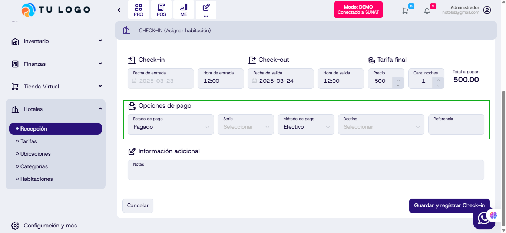

# Actualización en el sistema de recepción hotelera

## Agregar cantidad de personas en recepción del hotel

Se ha implementado una nueva funcionalidad que permite agregar y gestionar la cantidad de personas en la habitación al momento del check-in. Ahora, el usuario puede registrar múltiples huéspedes de manera más sencilla y eficiente, mejorando el control y la administración de las reservas.

## Agregar pagos en documentos

Se ha añadido la opción de registrar pagos directamente en los documentos del sistema. Esta mejora permite visualizar el estado del pago, seleccionar el método de pago e incluir referencias, lo que facilita el control financiero y la gestión contable de las transacciones.

