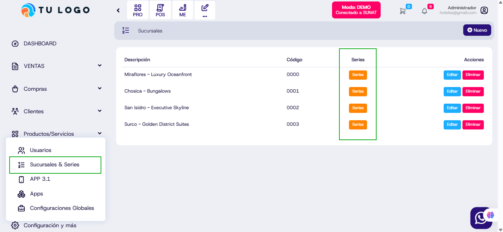

# Cambio en las denomiciones de Hoteles

## Cambio de "Establecimientos" a "Sucursales"
Se ha actualizado la denominación en el sistema, reemplazando el término "Establecimientos" por "Sucursales" para una mejor comprensión y coherencia con la operación del negocio.

## Nueva columna para Series
La funcionalidad de "Series" ahora se encuentra en una columna separada dentro de la lista de sucursales, mejorando la organización y visualización de la información.

