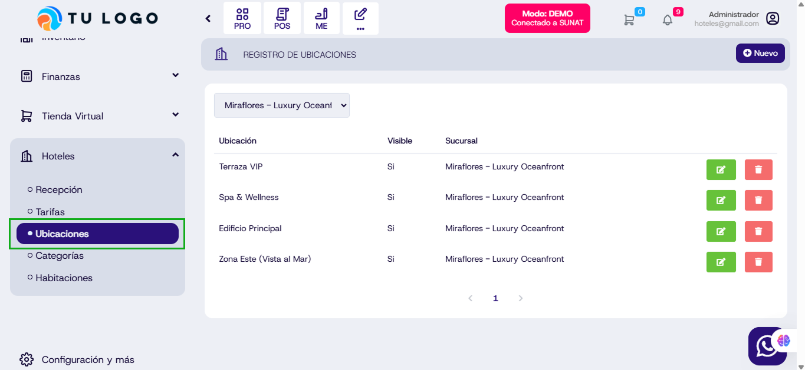

# Actualización en el submodulo Ubicaciones de Hoteles

## Cambio de término: Piso por Ubicación en Hotel

Se ha actualizado la terminología en el sistema de hoteles, reemplazando el término **"Piso"** por **"Ubicación"** para una mejor claridad y gestión de espacios.

