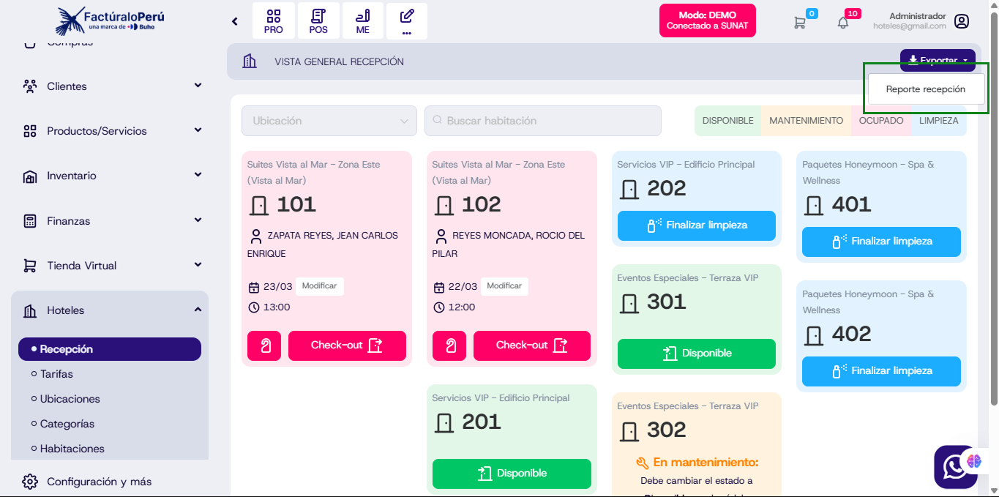
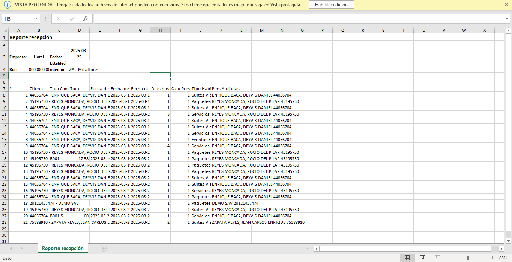

# Reporte de Recepción - Módulo Hoteles 

Se añadio la opcion de exportar **Reportes** desde el modulo de **Hoteles**

## Flujo del Reporte

### 1. Acceso al Módulo
1. Ingresar al sistema con credenciales de administrador.
2. Navegar al menú lateral izquierdo y seleccionar la sección **Hoteles > Recepción**.

### 2. Generación del Reporte
1. En la vista de recepción, hacer clic en el botón **Exportar** ubicado en la parte superior derecha.

2. Seleccionar la opción **Reporte Recepción**.
3. Se abrirá un modal donde se deben completar los siguientes campos:

   - **Fecha inicio**: Rango de inicio del reporte.
   - **Fecha término**: Rango final del reporte.
   - **Sucursal**: Selección de la ubicación del hotel.
4. Presionar el botón **Descargar** para generar el reporte.

### 3. Descarga del Reporte
1. El sistema generará un archivo en formato **Excel (.xlsx)** con la información de recepción del hotel.
2. El archivo incluirá columnas como:
   - Número de habitación
   - Cliente
   - Tipo de habitación
   - Fechas de ingreso y salida
   - Cantidad de personas alojadas
   - Estado de la habitación
3. Abrir el archivo Excel para revisar los datos exportados.

## Consideraciones
- El reporte se genera con datos basados en el rango de fechas seleccionado.
- Solo los usuarios con permisos de administración pueden exportar reportes.

