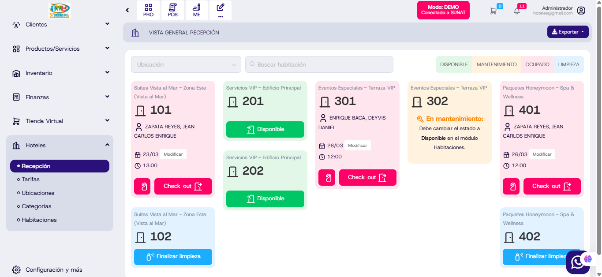

# style(hotel): Actualización de estilos y estructura

Se han **actualizado los estilos y la estructura** del módulo hotel, mejorando la coherencia visual y la usabilidad en la interfaz. Con estos cambios, se optimiza la presentación y la organización de los formularios y componentes, garantizando una experiencia más moderna y responsiva para el usuario.

