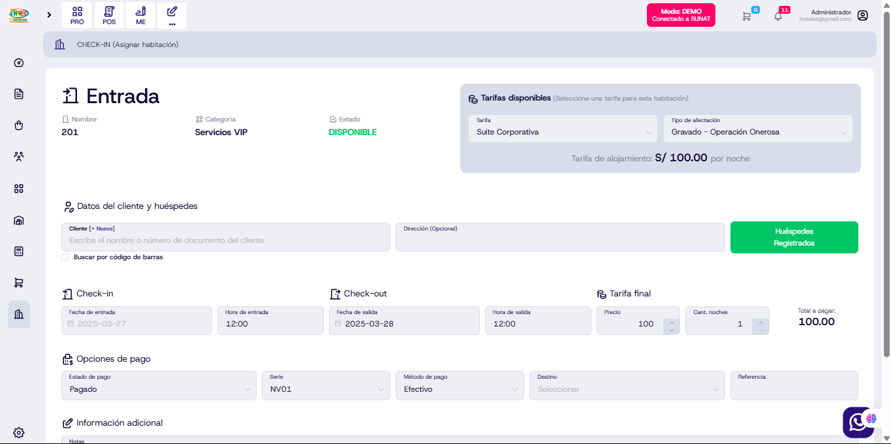

# Actualización en rentar habitación, agregar productos y checkout del módulo hotel

Se han realizado las siguientes mejoras en el módulo hotel para optimizar la experiencia de renta de habitación, la adición de productos y el proceso de checkout:

1. **Alinear la dirección con el campo de Clientes**  
   Ahora la dirección del huésped se muestra de forma coherente junto al campo de Clientes, mejorando la consistencia visual y facilitando la lectura de la información.

2. **Eliminar el campo "Nombres"**  
   Se ha removido el campo "Nombres" para simplificar el formulario y evitar redundancias en la captura de datos.

3. **La dirección ya no es un campo obligatorio**  
   Para agilizar el proceso de registro, la dirección deja de ser un requisito obligatorio. El usuario podrá omitirla si así lo desea, haciendo más flexible el llenado del formulario.

