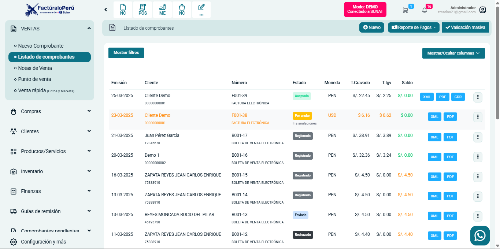

# Solucionar error al anular comprobante

Se corrigió el **error que impedía anular** un comprobante de forma correcta. Ahora, cuando el usuario desee anular un documento, el sistema procesará la operación sin inconvenientes, manteniendo la trazabilidad y la coherencia de la información.

