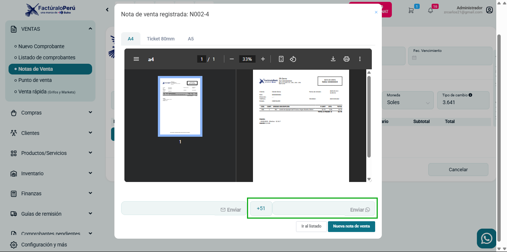

# Nueva funcionalidad: Envío de Nota de Venta por WhatsApp  

Se ha implementado la opción de enviar la Nota de Venta directamente por WhatsApp. Ahora, después de generar una nota, puedes compartir el documento con tu cliente de manera rápida y sencilla.  

## ¿Cómo funciona?  
1. Ingresa el número de WhatsApp del destinatario.  
2. Haz clic en el botón **"Enviar"**.  
3. El cliente recibirá un enlace con el PDF de la Nota de Venta.  

Esta mejora facilita la comunicación y agiliza la entrega de documentos.  

