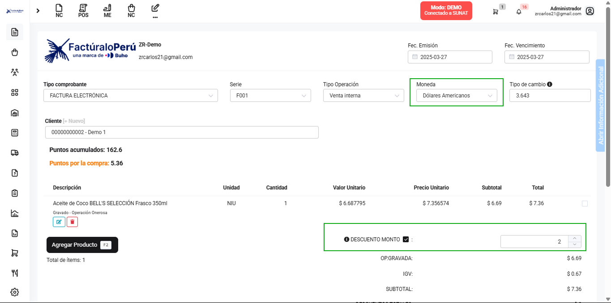
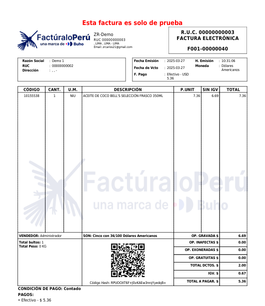

# Error en el descuento en cambio de dólar a soles al crear el componente

Se corrigió el error que afectaba el cálculo del descuento al convertir de dólar a soles durante la creación del componente. Ahora, el descuento se aplica correctamente en función de la tasa de cambio, asegurando que los montos finales sean precisos.

