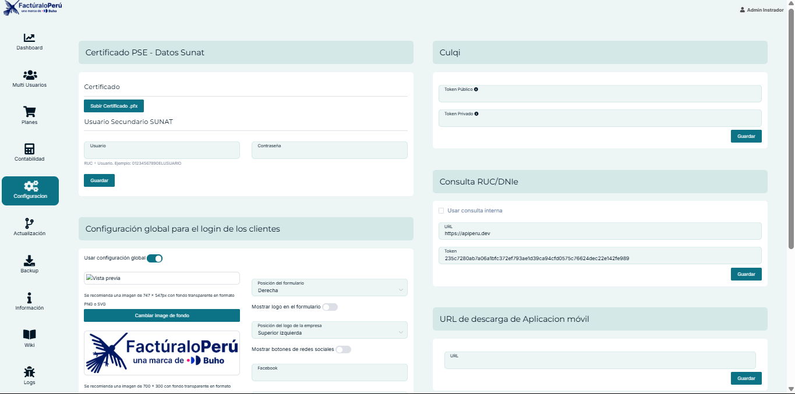

# Actualización de la Configuración del Panel Administrador

En este cambio se **añadió la opcion de colocar un logo en el panel administrador**. Además, se **movieron** el campo de teléfono y el switch para el ícono de soporte **del perfil a la sección de configuraciones**, unificando así la gestión de estos elementos y facilitando su administración.

**Puntos destacados:**
1. **Logo para Admin:**  
   - Se agregó un espacio dedicado para que el administrador principal pueda personalizar su logo.  
   - Este cambio refuerza la identidad visual en el panel de configuración principal.

2. **Campo teléfono y switch de soporte:**  
   - Ahora se gestionan directamente desde la configuración general en lugar de estar en el perfil de usuario.  
   - Facilita la actualización de datos de contacto y la activación o desactivación del ícono de soporte.

