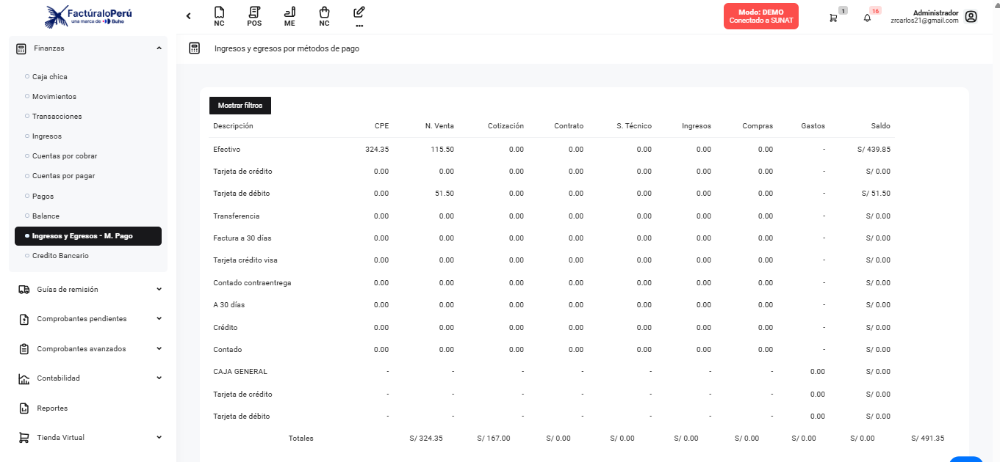

# Ajuste de tabla descuadrada en módulo Finanzas

Se corrigió el desajuste en la visualización de la tabla dentro del módulo de Finanzas. Con este ajuste, se solucionaron problemas de alineación y espaciado, lo que garantiza que la información financiera se muestre de forma ordenada y legible, mejorando la experiencia del usuario.

