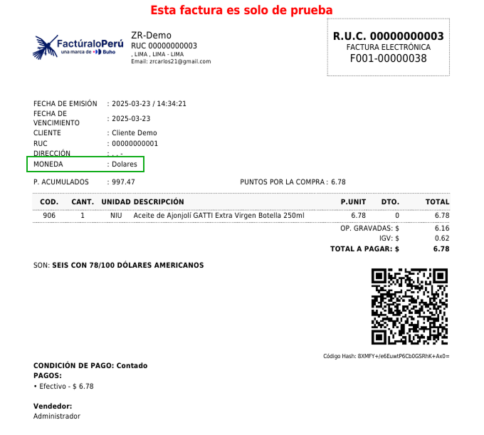

# Nueva Implementación: Campo de Moneda en Plantilla de Factura  

Se ha agregado un nuevo campo para mostrar la **moneda** en la plantilla predeterminada de facturas.  

## Mejoras añadidas:  
- **Visualización de moneda**: Ahora la factura indica la moneda en la que se realiza la transacción.  
- **Mayor claridad para el cliente**: Se evita confusión al especificar si la transacción es en **soles, dólares u otra moneda**.  
- **Ubicación estratégica**: El campo de moneda se muestra en la sección de información general de la factura.  

Esta actualización mejora la transparencia de las facturas y facilita la comprensión del monto a pagar.  

