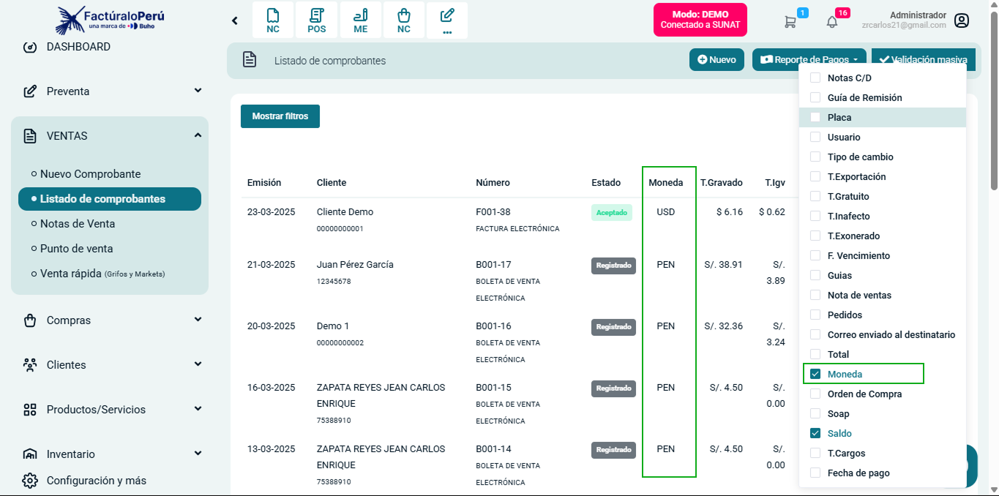

# Nueva Implementación: Símbolo de Moneda en Listado de Comprobantes y Más Módulos  

Se ha agregado el **símbolo de la moneda** en el listado de comprobantes y otros módulos, como **nota de venta, boleta, factura, entre otros**.  

## Mejoras añadidas:  
- **Mayor claridad en montos**: Ahora los valores monetarios se muestran con su símbolo correspondiente (**$**, **S/.**).  
- **Aplicación en múltiples módulos**: Se ha implementado en **notas de venta, boletas, facturas y otros documentos**.  
- **Facilidad de identificación**: Los usuarios podrán identificar rápidamente la moneda utilizada en cada transacción.  

Esta actualización mejora la presentación de los documentos y la experiencia del usuario en la plataforma.  

