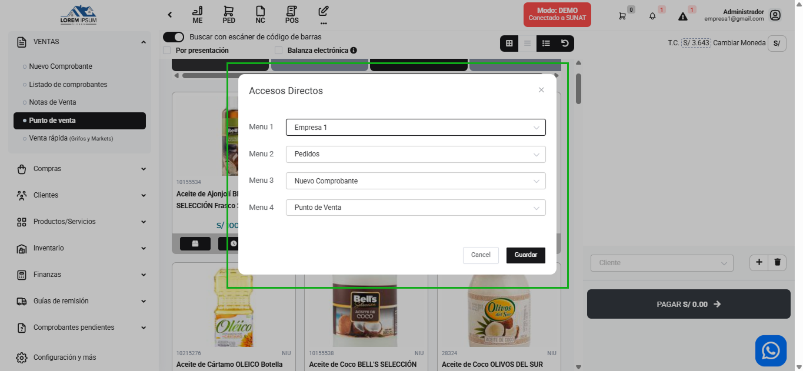

# Agregar nombres personalizados a accesos directos - Nueva función

Se ha implementado una nueva función que permite **agregar nombres personalizados** a los accesos directos. Con esta mejora, los usuarios podrán asignar nombres únicos y descriptivos a cada acceso, facilitando la identificación y organización dentro del sistema.

