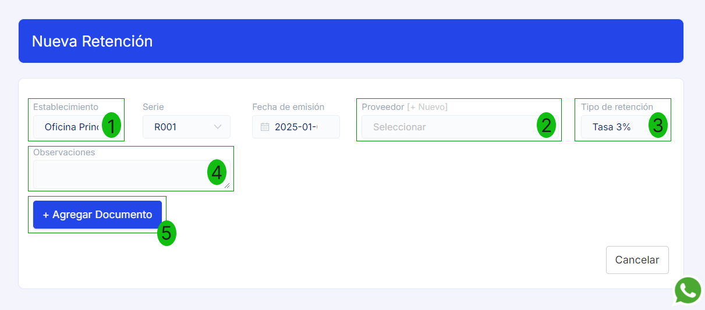
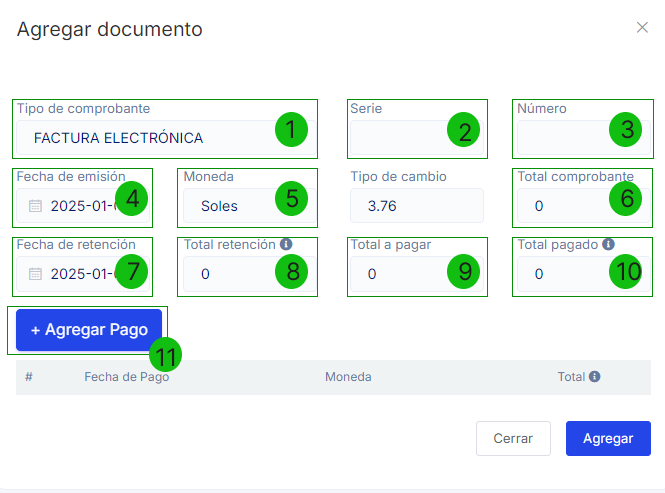
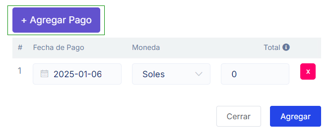

# Documentos de Retención

En este artículo te enseñaremos a crear documentos de retención. Sigue estos pasos para realizarlo:

Ingresa al módulo **Comprobantes avanzados** y selecciona la subcategoría **Retenciones**, selecciona el botón selecciona **Nuevo**.

Completa los siguientes datos:

- 1. Establecimiento:** Selecciona el establecimiento desde cual esta realizando el documento de detracción.
- 2. Proveedor:** Selecciona el Proveedor a quien le realizaras el documento de detracción, si aún no esta creado puede crearlo siguiendo este artículo.
- 3. Tipo de retención:** Selecciona el tipo de retención según sus requerimientos.
- 4. Observaciones:** Inserta alguna observación.
- 5. Selecciona el botón Agregar Documento:**

- 1. Tipo de comprobante:** Selecciona el tipo de comprobante si es factura o boleta.
- 2. Serie:** Ingrese la serie del comprobante.
- 3. Número:** Ingrese el número del comprobante.
- 4. Fecha de emisión:** Selecciona la fecha de emisión.
- 5. Moneda:** Seleccione si la moneda es en soles o dólares.
- 6. Total comprobante:** Ingresa el total del monto del comprobante.
- 7. Fecha de retención:** Selecciona la fecha de retención.
- 8. Total de retención:** Se auto completa el Total comprobante por Tasa de retención.
- 9. Total a pagar:** Ingresa el total a pagar.
- 10. Total pagado:** Se auto completa el **Importe total a pagar (neto) = Total pagos - Total retención**.

Selecciona el botón **Agregar Pago:** `[11]` 

- **Fecha de Pago:** Selecciona la fecha de pago.
- **Moneda:** Selecciona si el tipo de moneda.
- **Total:** Ingrese el monto total del comprobante.

:::info IMPORTANTE:
* Una vez agregado el pago se completara el Total pagado.
* Seguido selecciona el botón **Agregar** y después **Generar**.
:::
