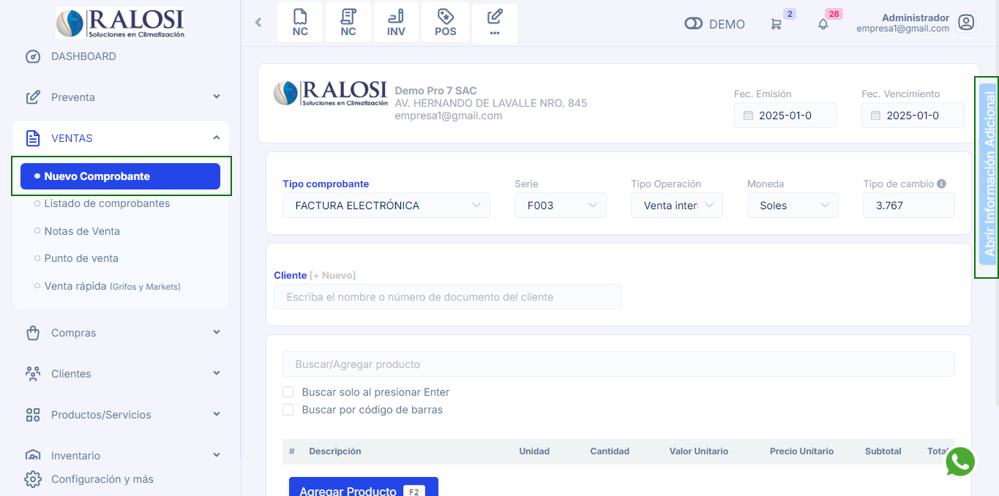
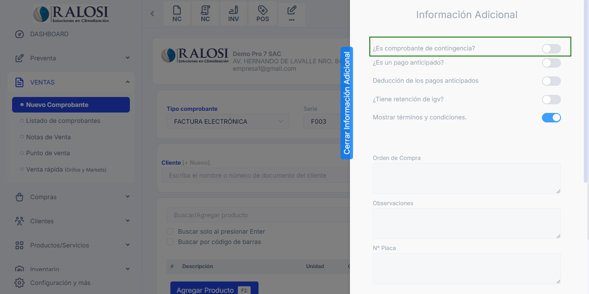
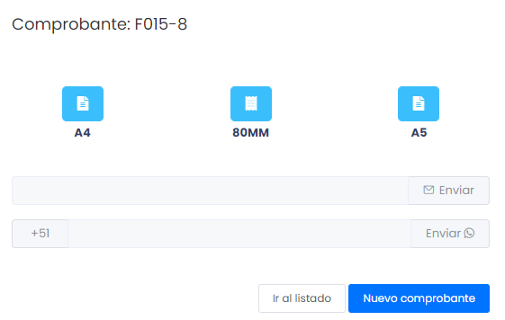

# Comprobantes de contingencia

Se considera que un comprobante de pago en formato pre impreso se emite en una situación de contingencia, cuando por causas ajenas al emisor electrónico por determinación, es decir circunstancias excepcionales, no puede emitir sus comprobantes de pago de manera electrónica.

Sigue estos pasos para realizarlo:

Previamente configura la serie de contingencia:

1. Ingresa al módulo de **Configuración y más** y luego selecciona la subcategoría **Locales & Series**.
2. Observara la lista de establecimientos.Seleccionamos el botón **Series**.

3. Nos aparecerá una ventana y seleccionamos el botón [+Nuevo] para agregar una serie.

4. Seguido aparecerá un pequeño formulario en donde se debe completar:

- **Tipo de documento:** Elegimos el tipo de documento que queremos agregar.
- **Número:** Colocar el número que corresponda segun mi serie física
- **D.Contingencia:** Es importante tener este cuadro marcado para realizar un comprobante de contingencia.

Y para guardar seleccionamos el botón de confirmación.

## Realizar el comprobante de pago

Ingresa al módulo de **Ventas** y luego selecciona la subcategoría **Comprobante electrónico**.

1. **Tipo de comprobante:** Seleccione qué tipo de comprobante desea realizar.
2. **Serie:** Seleccione la serie correspondiente que previamente configuró para los comprobantes de contingencia.
3. **Tipo de Operación:** Seleccione el tipo de operación que mejor se acomode a sus requerimientos.

4. **Moneda:** Podrá seleccionar si desea el pago sea en dólares o soles.

5. **Tipo de cambio:** Podrá seleccionar el tipo de cambio correspondiente si el pago es en dólares.

6. **Cliente:** Luego deberá escoger el cliente para la creación del comprobante, si no está creado, podrá realizarlo paso a paso en este **[artículo](https://fastura.github.io/documentacion/ventas/Emitir-comprobantes-Facturas-y-Boletas)**.

7. **Agregar producto:** Luego deberá escoger el producto para la creación del comprobante, si no está creado, podrá realizarlo paso a paso en este **[artículo](https://fastura.github.io/documentacion/ventas/Emitir-comprobantes-Facturas-y-Boletas)**.

8. **Activar comprobante de contingencia:** En la parte derecha superior podrá activar un menu despegable con el nombre de **Informacion Adicional**, tendra que activar la opcion de  **comprobante de contingencia**, y automáticamente el sistema activará la serie correspondiente, previamente creada.

Después selecciona el botón **GENERAR**, donde se visualizará una ventana indicando que el comprobante ha sido aceptada.

Además podrás escoger el formato del comprobante electrónico en tamaño **A4(vertical), 80MM (ticket) y A5(horizontal)**.

Asimismo puedes enviarlo por correo electrónico o WhatsApp, ingresando el dato del destinatario y seleccionando el botón **Enviar**.

Finalmente puedes seleccionar el botón  ir al listado, donde visualizará los comprobantes generados,  o proceder a crear **nuevo comprobante de contingencia**.

:::info IMPORTANTE:
Para más información acerca de los comprobantes de contingencia: **[https://cpe.sunat.gob.pe/informacion_general/procedimiento_contingencia](https://cpe.sunat.gob.pe/informacion_general/procedimiento_contingencia#:~:text=con%20determinados%20requisitos.-,Procedimiento%20de%20Contingencia,de%20pago%20de%20manera%20electr%C3%B3nica)**, y/o, consulte a su área contable.
:::
