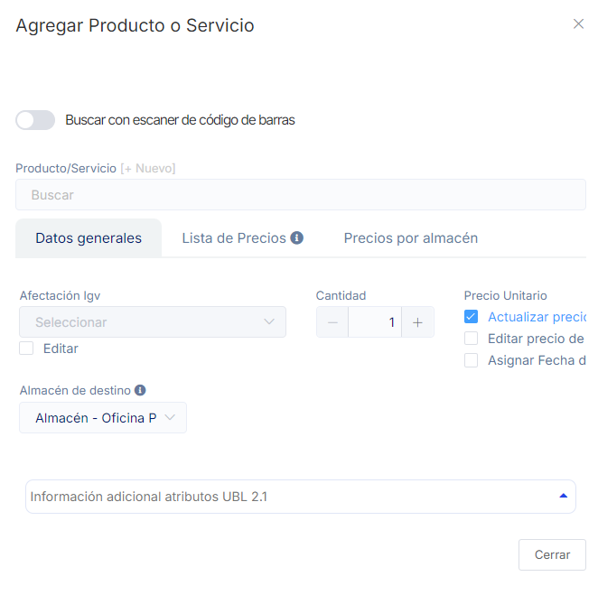

# Liquidaciones de compra

Las liquidaciones de compra son documentos esenciales que respaldan las operaciones comerciales y deben ser emitidas por el proveedor de bienes o servicios. Estos registros son de suma importancia en el contexto de las transacciones comerciales y tributarias. En este artículo, te guiaremos a través de los pasos necesarios para crear y gestionar adecuadamente documentos de liquidaciones de compra, asegurando un cumplimiento óptimo de las regulaciones tributarias. Sigue estos pasos para llevar a cabo este proceso de manera efectiva:

Ingresa al módulo **Comprobantes avanzados** y selecciona la subcategoría **Liquidaciones de Compra**, selecciona el botón selecciona **Nuevo**.

Completa los siguientes datos:

- **1. Tipo comprobante:** Selecciona el establecimiento desde cual esta realizando el documento de liquidación de compras.
- **2. Proveedor:** Selecciona el Proveedor a quien le realizaras el documento de detracción, si aún no esta creado puede crearlo siguiendo este **[artículo](https://fastura.github.io/documentacion/compras/Proveedores-creaci%C3%B3n-individual)**.
- **3. bservaciones:**
- **4. Condición de pago:**
- **5. Agregar Producto:**

- **Producto/Servicio:** Insertar el producto, si aún no lo creo selecciona +Nuevo, y sigue el siguiente **[artículo](https://fastura.github.io/documentacion/productos-servicios/Productos-Creacion-basica)**.
- **Cantidad:** Inserta la cantidad del producto.
- **Almacén de destino:** Selecciona el almacén de destino para el producto.

Seguido selecciona el botón **Agregar** y después **Generar**.

:::danger IMPORTANTE:
Todos los comprobantes emitidos seran enviados a Sunat
:::
