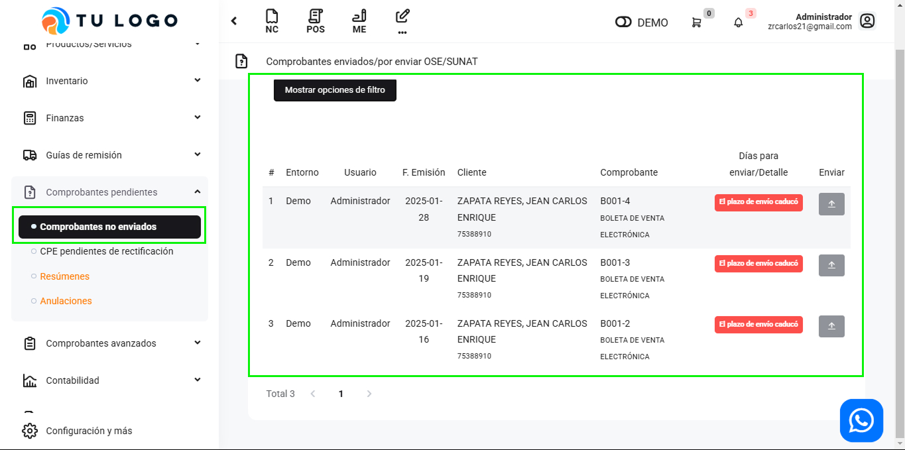

# Comprobantes no enviados

En esta área se visualizarán los comprobantes que no se han enviado debido a un inconveniente en el sistema de la SUNAT u otras casuísticas.

Ingresa al módulo **Comprobantes Pendientes** y luego dirígete a la subcategoría **Comprobantes no enviados**.

Encontrarás facturas y boletas que no han sido enviadas a la SUNAT.

:::danger IMPORTANTE:
- Por defecto deben aparecer solo las Boletas del día, ya que estas se envían a través de resúmenes diarios. De encontrar otros comprobantes aparte por favor notificar a Soporte. Asimismo, en caso nosotros le hayamos indicado desactivar el botón **“envío de comprobantes automático”**,*(Ubicado en **Configuración y más**, en **Configuraciones Globales**, en la sección **Empresa** y subcategoría **Avanzado**)*. Siempre posteriormente, cuando esté en funcionamiento las respuestas de SUNAT, se procederá a notificar habilitarlo nuevamente.
:::

## Envia tus facturas pendientes

Se enviarán manualmente las facturas, seleccionando el botón azul para enviarlo. Y aparecerá el siguiente mensaje **"La factura/boleta ha sido aceptada"**

### Boletas

Para enviar las boletas, se deberá ingresar al módulo de **ventas** en la sección **Resúmenes y anulaciones** ,luego en subcategoría resúmenes,donde se añadirá la fecha de emisión de los comprobantes,después selecciona buscar comprobantes y **guardar**.

Finalmente selecciona el boton naranja Consultar y  se habrá enviado la boleta.

:::info IMPORTANTE:
Revisar periódicamente que los comprobantes electrónicos se hayan enviado a SUNAT dentro del plazo estimado de envío, asimismo lo podrá observar dentro de la **campana de notificaciones** que se encuentra en la parte superior derecha de su plataforma.
:::
