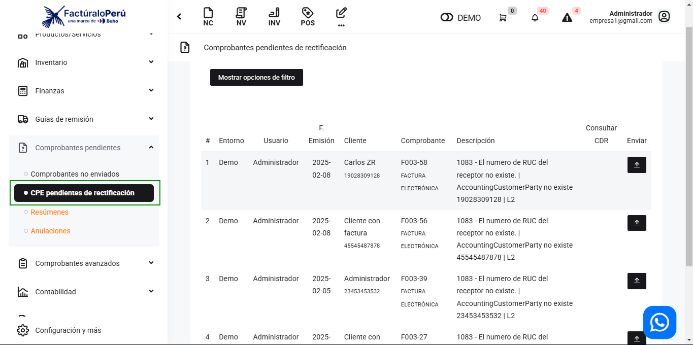
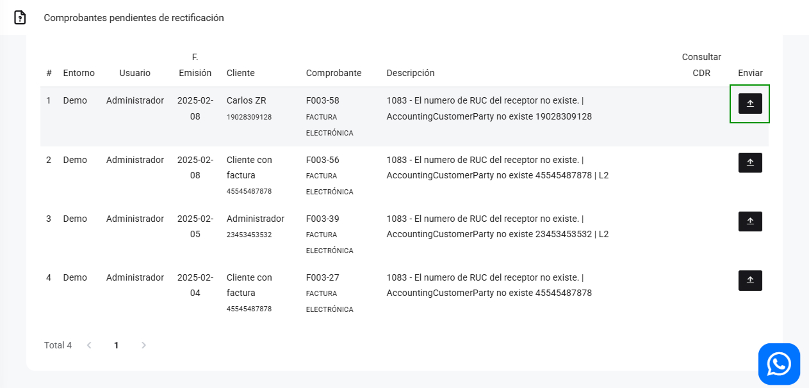

# Comprobantes pendientes de rectificación

Los comprobantes pendientes de rectificación son documentos que requieren corrección o ajuste debido a errores. En ocasiones, los servidores de la Sunat no responden a la solicitud que nuestro sistema realiza para poder enviar los comprobantes electrónicos.

En este artículo, te ayudaremos a rectificar los documentos que están pendientes de corrección. Sigue los siguientes pasos para hacerlo:

Existen dos maneras de acceder a los comprobantes pendientes de rectificación:

Puedes acceder seleccionando el icono de advertencia en la parte inferior derecha o ingresando al módulo de ventas y seleccionando la opción **cpe comprobantes pendientes de rectificación**

Para enviar tus documentos pendientes con rectificación, debes seleccionar el botón **Consultar CDR** seguido el botón **Enviar**.

En conclusión, los comprobantes pendientes de rectificación son documentos contables que requieren corrección debido a errores. Este artículo ofrece una guía para corregirlos, destacando la importancia de mantener registros precisos y cumplir con las regulaciones fiscales, lo que ayuda a evitar problemas contables y tributarios.
