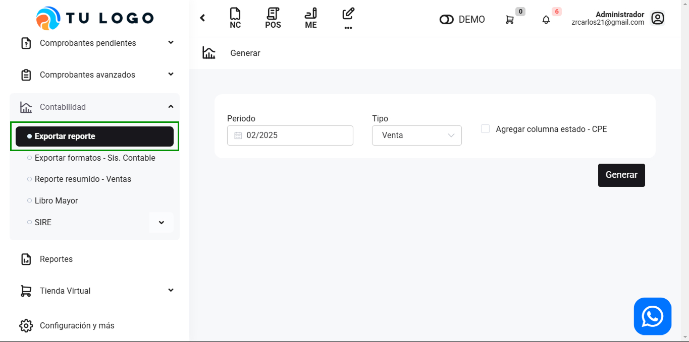
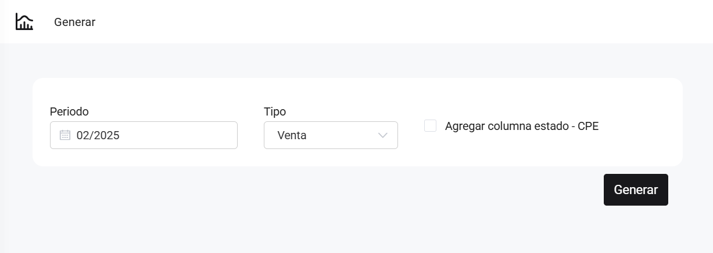

# Exportar reporte

En este articulo te ayudaremos a exportar reporte de venta y compra. Sigue estos pasos para realizarlo:

Ingresa al módulo de **Contabilidad** y luego selecciona subcategoría **Exportar reporte**.

Completa lo siguiente:

* **Periodo:** Selecciona el periodo del que deseas generar un reporte.
* **Tipo:** Selecciona entre Venta, Compra, Venta (Grifo).
* **Casilla de selección- Agregar columna estado - CPE:**  Selecciona si desea agregar el estado de los comprobantes electrónicos.

Seguido selecciona en botón **Generar**. Se descargará un excel con el reporte.
