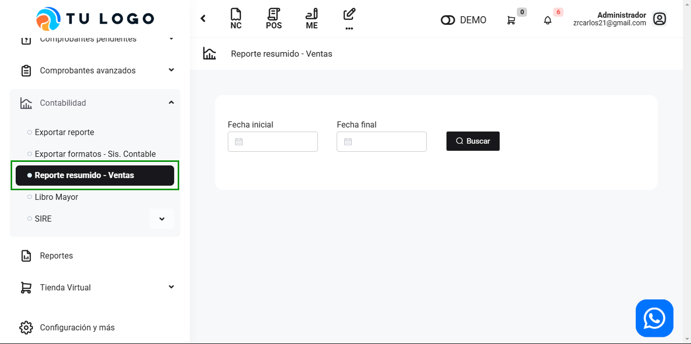
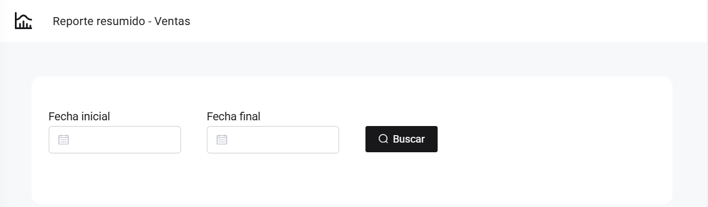
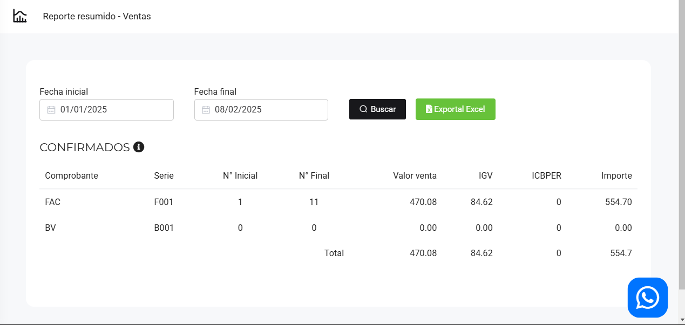

# Reporte resumido - Ventas

En este articulo te ayudaremos a realizar un reporte resumido de ventas. Sigue estos pasos para realizarlo:

Ingresa al módulo de **Contabilidad** y luego selecciona subcategoría **Reporte resumido - Ventas**.

Completa lo siguiente:

* **Fecha inicial:** Selecciona la fecha inicial.
* **Fecha final:** Selecciona la fecha final.

Seguido selecciona el botón **Buscar**, para que puedas ver el detallado de tu reporte resumido. También podrá descargar un Excel, seleccionando el botón correspondiente.

:::danger IMPORTANTE:

Solo se observaran los comprobantes electrónicos **ACEPTADOS**.

:::
