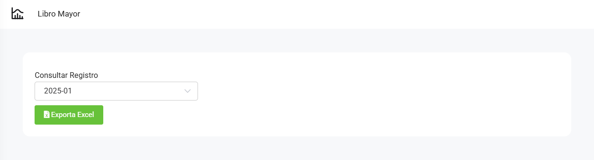

# Libro mayor

En este articulo te ayudaremos a descargar el reporte de **Libro mayor**. Sigue estos pasos para realizarlo:

Ingresa al módulo de **Contabilidad** y luego selecciona subcategoría **Libro mayor**.

Completa lo siguiente:

* **Consultar Registro:** Selecciona el registro que va a exportar.

Seguido selecciona el botón **Exportar Excel**. Se descargará el archivo excel correspondiente.
