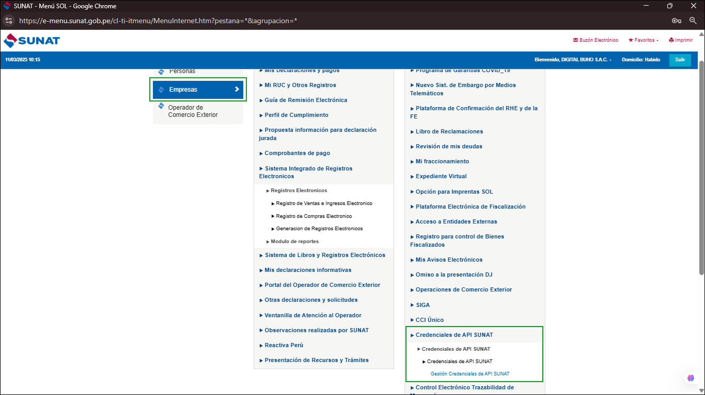
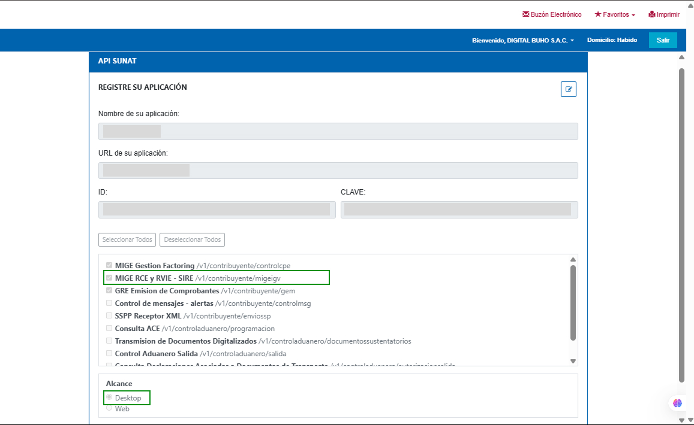
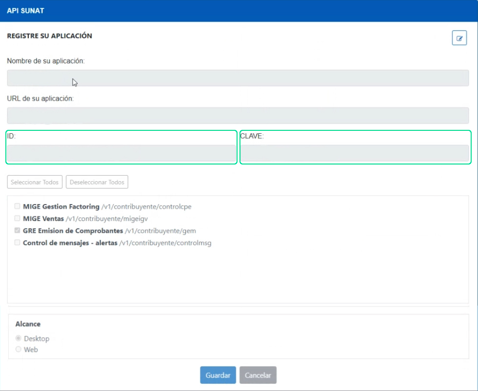
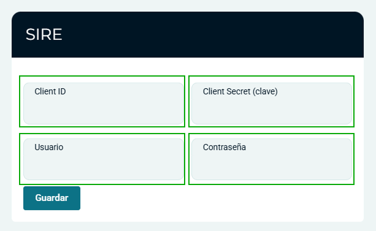

# Configuración previa - SIRE

Ingresa al módulo **Configuración y más** y en el submodulo **Configuraciones Globales** .

Debera elegir la submodulo **Empresa**, en la subcategoria **Empresa**

Deberá completar los siguientes campos:

## SIRE

* **Client ID:** Coloque el ID generado en la plataforma SUNAT.
* **Client Secret (Clave):** Coloque la clave generada en la plataforma SUNAT.

:::danger importante

Para llenar **Client ID** y **Client Secret (Clave)** debe ingresar a la plataforma SUNAT con la clave **SOL**.

:::

Al ingresar a SUNAT, seleccionamos **Credenciales de API SUNAT/ Credenciales de API SUNAT/ Credenciales de API SUNAT** y por último **Gestión Credenciales de API SUNAT**.

Para registrar la aplicación, tendrá que completar:

* **Nombre de su aplicación:** Ingresa el nombre de su aplicación. Por ejemplo: Factura fácil.
* **URL de su aplicación:** Ingresa la URL de su aplicación. Por ejemplo: [buho.fastura.app](https://buho.fastura.app)
* **Casillas de selección:** Selecciona la casilla GREE Emision de Comprobantes/v1/contribuyente/gem.
* **Alcance:** Selecciona la casilla Desktop.
Después selecciona el botón **Guardar**, se generará un token en los campos **ID** y **CLAVE**.

Copiamos esos accesos y lo pegamos en:

* **Client ID:** Coloque el ID generado en la plataforma SUNAT.
* **Client Secret (Clave):** Coloque la clave generada en la plataforma SUNAT.
* **Usuario:** Ingrese el nombre de usuario proporcionado por SUNAT.
* **Contraseña:** Ingrese la contraseña proporcionada por SUNAT.
* **ID -> Client ID**
* **CLAVE -> Client Secret (Clave)**

