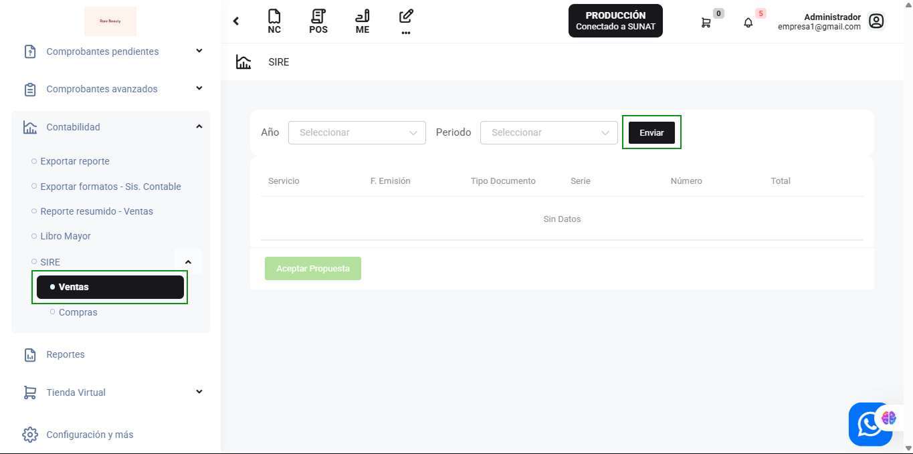
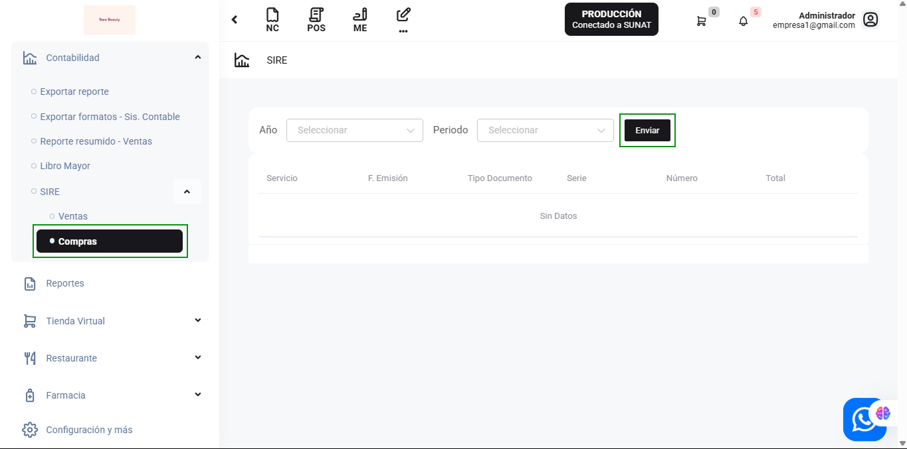
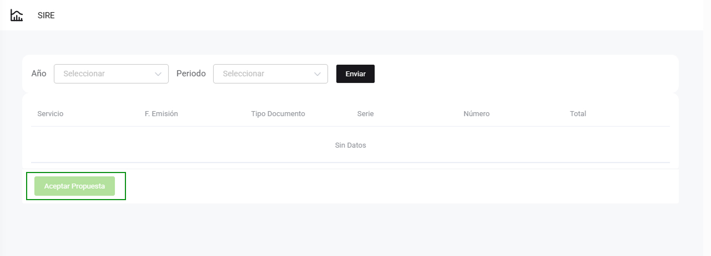

# SIRE

En este artículo te ayudaremos a utilizar el módulo SIRE para consultar y gestionar tus ventas y compras. Sigue estos pasos para realizarlo:

## Acceso al módulo SIRE

1. Ingresa al módulo de **Contabilidad**.
2. Selecciona la subcategoría **SIRE**.
3. Dentro de SIRE, puedes elegir entre **Ventas** o **Compras**.

## Consultar Ventas

1. Selecciona **Ventas** en el menú de SIRE.
2. Completa los siguientes campos:
   - **Año:** Selecciona el año del que deseas consultar las ventas.
   - **Periodo:** Selecciona el periodo específico dentro del año.
3. Haz clic en el botón **Enviar** para generar la consulta.

### Resultado de la consulta

El sistema mostrará una tabla con la siguiente información:
- **Servicio**
- **F. Emisión**
- **Tipo Documento**
- **Serie**
- **Número**
- **Total**

Si no hay datos disponibles para el periodo seleccionado, se mostrará el mensaje "Sin Datos".

## Consultar Compras

1. Selecciona **Compras** en el menú de SIRE.
2. Completa los siguientes campos:
   - **Año:** Selecciona el año del que deseas consultar las compras.
   - **Periodo:** Selecciona el periodo específico dentro del año.
3. Haz clic en el botón **Enviar** para generar la consulta.

### Resultado de la consulta

El sistema mostrará una tabla con la siguiente información:
- **Servicio**
- **F. Emisión**
- **Tipo Documento**
- **Serie**
- **Número**
- **Total**

Si no hay datos disponibles para el periodo seleccionado, se mostrará el mensaje "Sin Datos".

## Aceptar Propuesta

En ambas secciones (Ventas y Compras), después de realizar la consulta, puedes aceptar la propuesta generada haciendo clic en el botón **Aceptar Propuesta**.

Con estos pasos, podrás gestionar y consultar tus ventas y compras de manera eficiente utilizando el módulo SIRE.