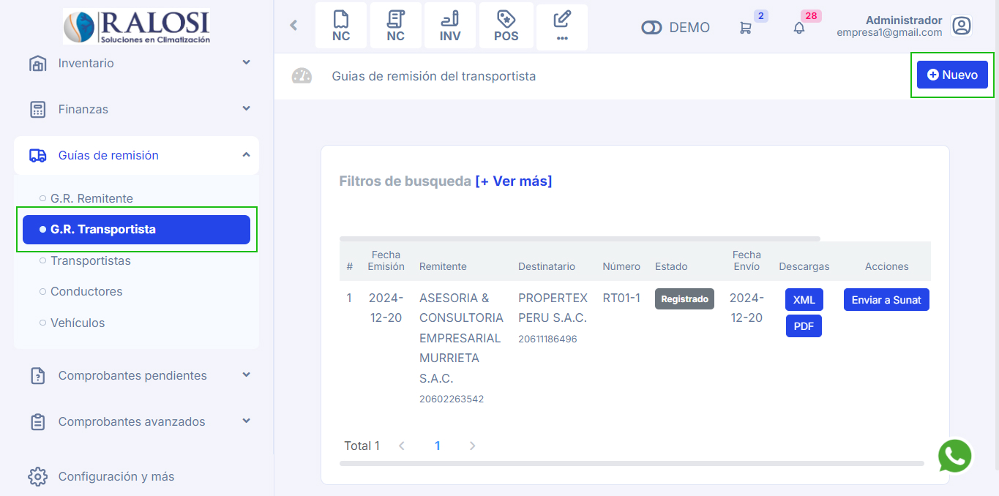
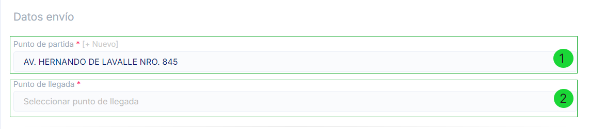
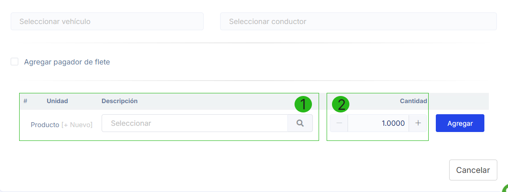

# Guías de transportistas

En este artículo te enseñaremos a como generar tus guías de remisión. Sigue estos pasos para realizarlo:

Ingresa al módulo de **Guías de remisión** y luego selecciona la subcategoría **G.R Transportista**. En la parte superior derecha selecciona el botón Nuevo.

Tendrá que rellenar los siguientes campos:

- **1. Establecimiento:** Selecciona el establecimiento.
- **2. Serie:** Selecciona la serie.

:::info IMPORTANTE
 La serie previamente configurada en el módulo **Configuraciones y mas**, categoría **Locales y series**, la series inicia **V001**.
:::

- **3. Fecha de emisión:** Ingresa la fecha de emisión.
- **4. Fecha de traslado:** Ingresa la fecha de traslado.
- **5. Unidad de medida:** Selecciona la unidad de medida que más se acomode a sus requerimientos.
- **6. Peso total:** Ingresa el peso total del producto.
- **7. Remitente:** Selecciona al remitente, también puede crear un nuevo punto de llegada seleccionando el botón +Nuevo.
- **8. Punto de partida:** Selecciona el punto de partida correspondiente, también puede crear un nuevo punto de partida seleccionando el botón +Nuevo.
- **9. Destinatario:** Selecciona el destinatario correspondiente, también puede crear un nuevo punto de partida seleccionando el botón +Nuevo.
- **10 . Punto de llegada:** Selecciona el punto de llegada, también puede crear un nuevo punto de llegada seleccionando el botón +Nuevo.

:::info IMPORTANTE

 Si el punto de llegada no carga una vez seleccionado el cliente, selecciona el botón +Nuevo y sin necesidad de llenar algún dato seguido selecciona el botón Buscar y una vez cargado los datos selecciona el botón **Guardar**.

:::

- **Datos del vehículo:** Selecciona uno o varios vehículos y sus números de placas correspondientes, o crea un nuevo vehículo con el botón **+Nuevo**.
- **Datos del conductor:** Selecciona uno o varios conductores, también puedes crear un nuevo conductor con el botón **+Nuevo**.

## Agregar Producto:

1. Para agregar el producto a trasladar:

   - **1. Producto:** Ingresa el nombre del producto en la **Descripción**. Si necesitas crear uno nuevo, selecciona el botón **+Nuevo** y sigue los pasos en este **[artículo](https://manual.uio.la/Pro7/Modulos/Esenciales/productos-servicios/Productos-Creacion-basica).**
   - **2. Cantidad:** Ingresa la cantidad del producto.

2. Una vez completado, selecciona el botón **Agregar** y luego **Generar**.
