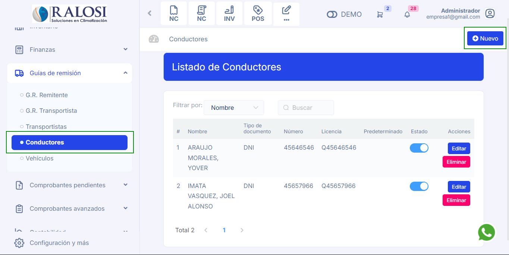

# Creación de conductores

En este artículo te enseñaremos a como crear conductores para tu guía de remisión. Sigue estos pasos para realizarlo:

Ingresa al módulo de **Guias de Remisión** y luego selecciona la subcategoría **Conductores**. En la parte superior derecha selecciona el botón **Nuevo**.

## Crear nuevo conductor

Completa los siguientes campos:

**1. Tipo Doc. Identidad:** Selecciona el tipo documento de identidad: Doc.trib.no.dom.sin.ruc, DNI, CE, RUC, Pasaporte.

**2. Número:** Ingresa el número del documento según lo que selecciono. Seguido selecciona el botón **RENIEC o SUNAT**, se autocompletará el nombre.

**3. Nombre:** Ingresa el nombre del conductor.

**4. Licencia:** Ingresa su licencia de conducir.

**5. Teléfono:** Ingresa su teléfono.

**6. Predeterminado:** Activa si el conductor es de manera frecuente.

Seguido seleccione el botón **Guardar**. Y podrá visualizar al conductor creado.
