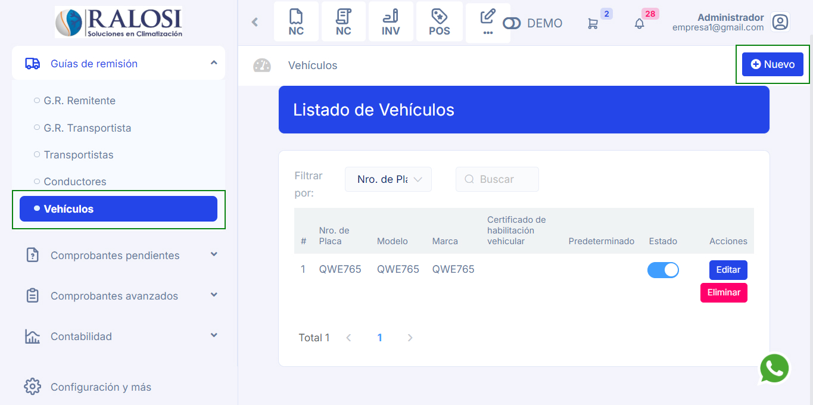

# Creacion de Vehículos

En este artículo te enseñaremos a como crear vehículos para tu guía de remisión. Sigue estos pasos para realizarlo:

Ingresa al módulo de **Guias de Remisión** y luego selecciona la subcategoría **Vehículos**. En la parte superior derecha selecciona el botón **Nuevo**.

Completa los siguientes campos para crear un nuevo vehículo:

**1. Nro. de Placa:** Inserta el nro. de la placa.

**2. Modelo:** Inserta el modelo del vehículo.

**3. Marca:** Inserta la marca del vehículo.

**4. Predeterminado**: Activa si el vehículo es de manera frecuente.

**5. Certificado de habilitación vehicular:** Campo donde se debe ingresar el número del certificado que acredita la habilitación del vehículo para operar.

Seguido seleccione el botón **Guardar**. Y podrá visualizar al transportista creado.
