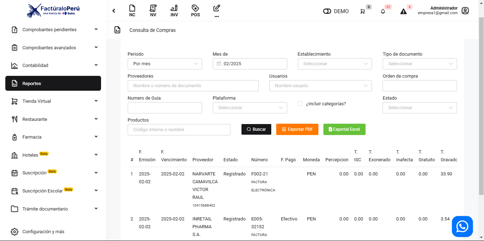
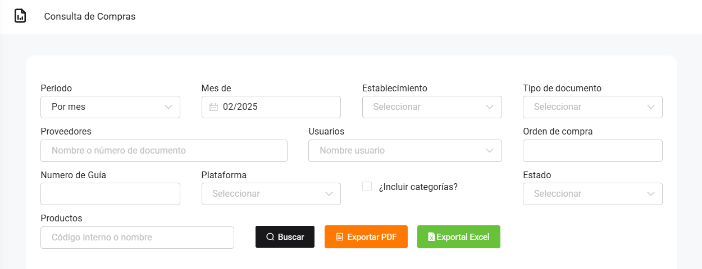

# Compras: Reporte general

En este artículo te mostraremos como revisar sus compras totales realizadas. Sigue estos pasos para realizarlo:

Ingresa al módulo de **Reportes** y luego en la subcategoría **Compras**, selecciona **Compras totales**.

Aparecerá lo siguiente:

Completa los siguientes filtros:

:::danger IMPORTANTE:

Selecciona solo los filtros que requiera.
:::

Podrá exportar los reportes, seleccionando el botón correspondiente.

Luego seleccione el botón Buscar. Se observaran las compras totales realizadas.

