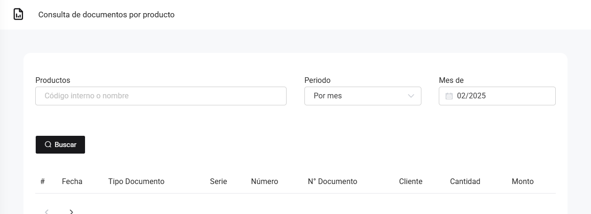

# Compras: Producto - búsqueda individual

En este artículo te mostraremos como revisar sus compras realizadas sobre un producto especifico. Sigue estos pasos para realizarlo:

Ingresa al módulo de **Reportes** y luego en la subcategoría **Compras**, selecciona **Producto - búsqueda individual.**

Aparecerá lo siguiente:

Completa los siguientes filtros:

:::danger IMPORTANTE:

Selecciona solo los filtros que requiera.
:::

Podrá exportar los reportes, seleccionando el botón correspondiente.

Luego seleccione el botón Buscar. Se observan las compras con el producto que seleccionó:

