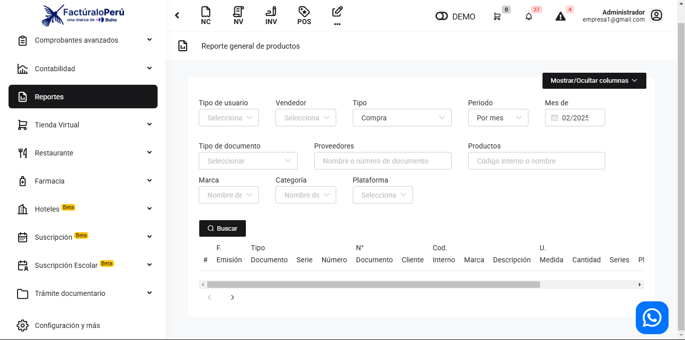
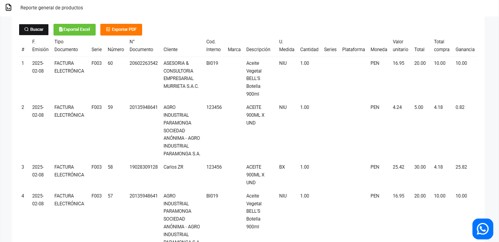

# Compras: Producto

En este artículo te mostraremos como revisar las compras por el filtro de productos. Un reporte más detallado de los productos. Sigue estos pasos para realizarlo:

Ingresa al módulo de **Reportes** y luego en la subcategoría **Compras**, selecciona **Productos.**

Aparecerá lo siguiente:

Completa los siguientes filtros:

:::danger IMPORTANTE:

Selecciona solo los filtros que requiera.
:::
Podrá exportar los reportes, seleccionando el botón correspondiente.

Luego seleccione el botón **Buscar**. Se observan las compras realizadas con el producto que selecciono, por cada producto aparecerá una diferente linea detallada a pesar que se encuentren en el mismo comprobante electrónico:

