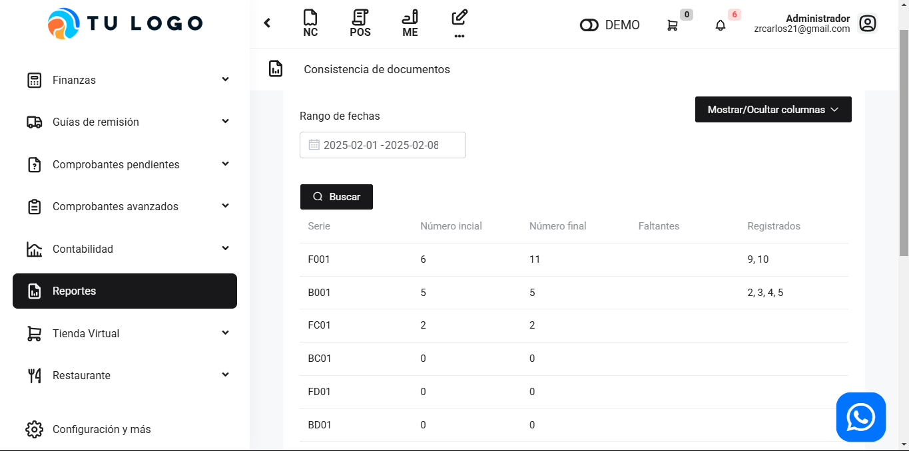

# General: Consistencia de documentos

En este artículo te mostraremos como revisar la lista de los correlativos de los comprobantes electrónicos .Sigue estos pasos para realizarlo:

Ingresa al módulo de **Reportes** y luego en la subcategoría **General**, selecciona **Consistencia documentos**

Aparecerá lo siguiente:

Cuenta con un filtro de fechas. En cada casilla observará lo siguiente:

* **Series:** La serie de los documentos.
* **Número inicial:** El correlativo, el número inicial.
* **Número final:** El correlativo, el número final.
* **Faltantes:** Se encuentran los comprobantes con algún error.
* **Registrados:** Se encuentran todos los comprobantes con el estado registrado.
