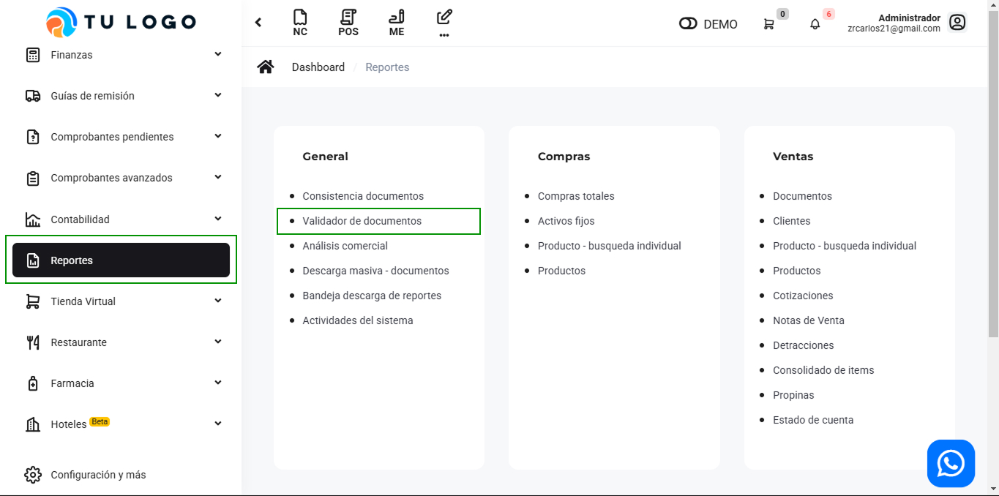
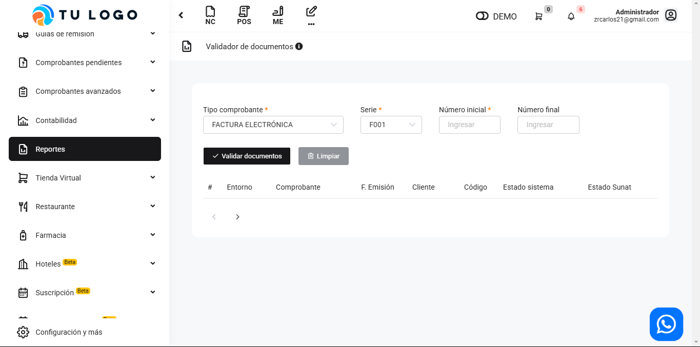
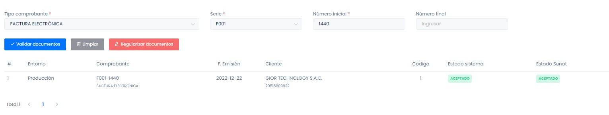

# General: Validador de documentos

En este artículo te mostraremos a como utilizar el validador de documentos .Sigue estos pasos para realizarlo:

Ingresa al módulo de **Reportes** y luego en la subcategoría **General,** selecciona **Validador de documentos.**

Aparecerá lo siguiente:

Completa los siguientes filtros:

Podrá observar el estado del sistema y el estado de **SUNAT**, en caso que sean diferentes los estados; selecciona el botón **Validar documentos** para que los estados se igualen.

