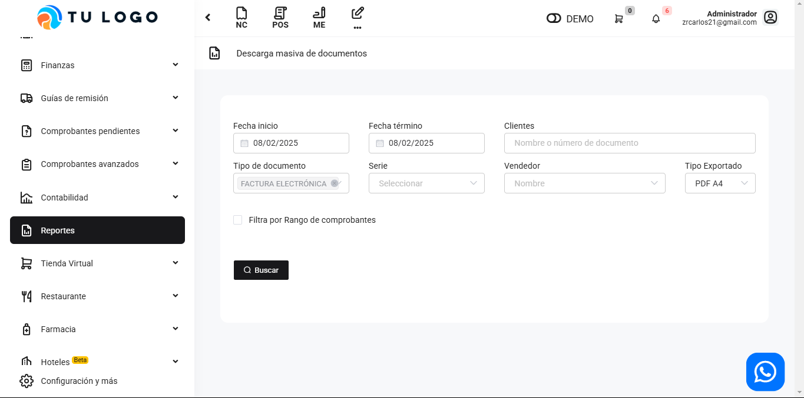

# General: Descarga masiva - documentos

En este artículo te mostraremos como descargar los documentos de manera masiva.

Sigue estos pasos para realizarlo:

Ingresa al módulo de **Reportes** y luego en la subcategoría **General**, selecciona **Descarga masiva-documentos**.

Aparecerá lo siguiente:

Completa los siguientes filtros:

Luego seleccione el botón **Buscar**. Se observarán los documentos encontrados, y seleccionando el botón **Exportar PDF**, podrá exportar todos los documentos en **PDF**.
