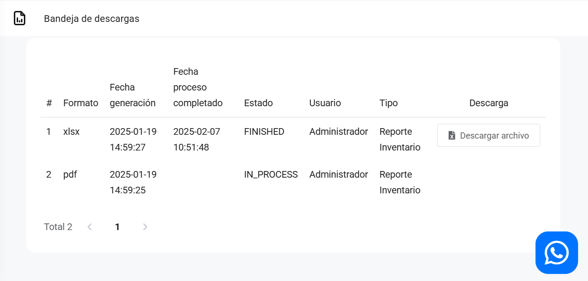

# General: Bandeja descarga de reportes

En este artículo te mostraremos como descargar los reportes que debido a su gran tamaño se van a la bandeja de descarga.

Sigue estos pasos para realizarlo:

Ingresa al módulo de **Reportes** y luego en la subcategoría **General**, selecciona **Bandeja de descarga de reportes**.

Aparecerá lo siguiente:

## Bandeja de descargas

Hay algunos reportes que por su tamaño no van a descargarse de manera inmediata, sino que van a esta bandeja de descargas, una vez que el estado este en **FINISHED**, seleccionando el botón **Descargar archivo para descargar el reporte.**
