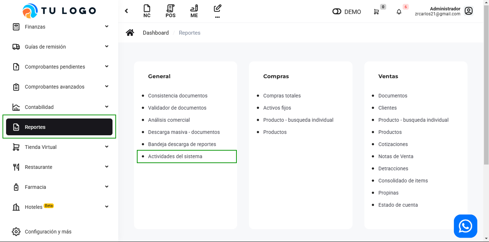
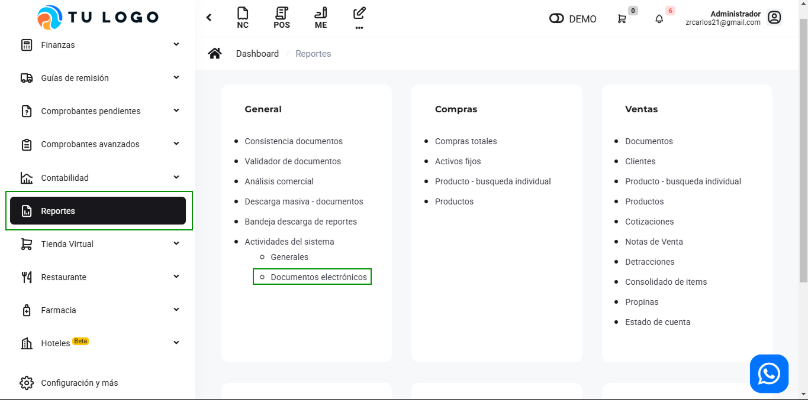

# General: Actividades del sistema

En este artículo te mostraremos como revisar las acciones del sistema de manera general. Sigue estos pasos para realizarlo:

Ingresa al módulo de **Reportes** y luego en la subcategoría **General**, selecciona **Actividades del sistema.**

## Generales

Esta área resume todas los inicios de sesión de sesión en diferentes dispositivos que se hayan realizado.

Dentro de Actividades del sistema, selecciona la subcategoría **Generales.**

Tendrá información de que usuario y desde que equipo ingresó al sistema.

## Documentos electrónicos

Esta área observará todas las transacciones dentro del sistema por comprobante.

Dentro de **Actividades del sistema,** selecciona la subcategoría **Documentos electrónicos.**

Tendrá detalles del usuario, la fecha y hora, el tipo de documento que se realizó.

