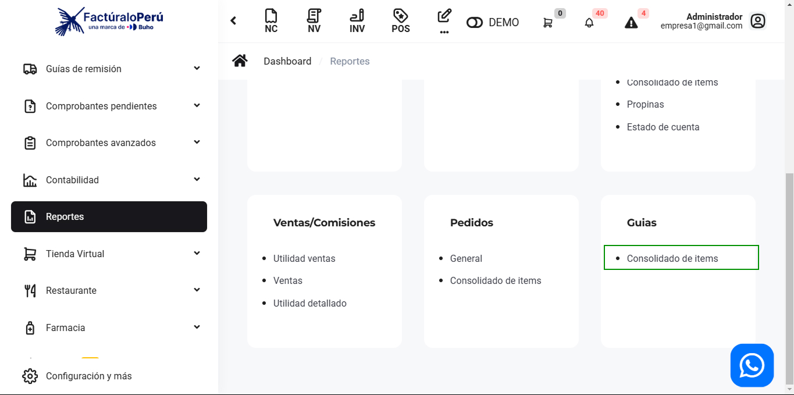
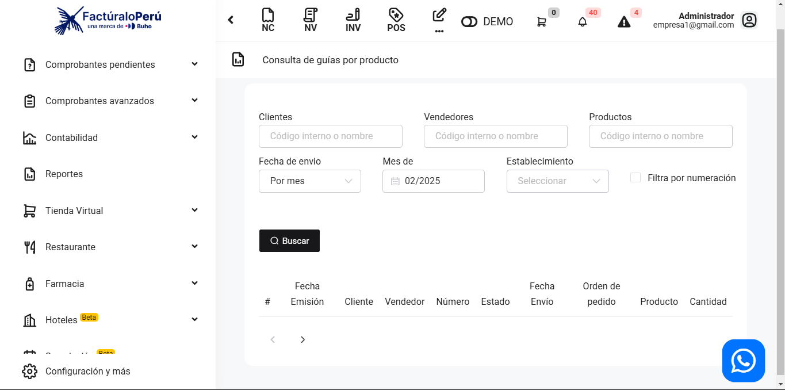
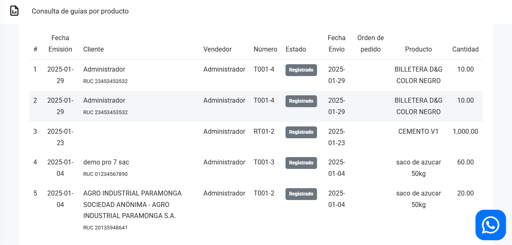

# Guías: Consolidado de ítems

En este artículo te mostraremos a como exportar las guías realizadas. Sigue estos pasos para realizarlo:

Ingresa al módulo de **Reportes** y luego en la subcategoría **Guías**, selecciona **Consolidado de ítems.**

Aparecerá lo siguiente:

Completa los siguientes filtros:

:::danger IMPORTANTE:
Selecciona solo los filtros que requiera.
:::
Podrá exportar los reportes, seleccionando el botón correspondiente.

Luego seleccione el botón **Buscar.** Se observan las guías realizadas, de acuerdo al periodo seleccionado.

