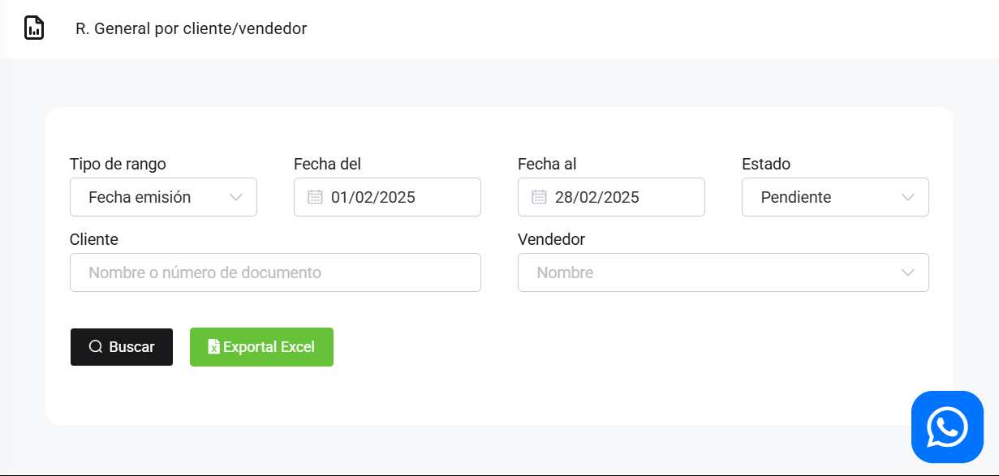
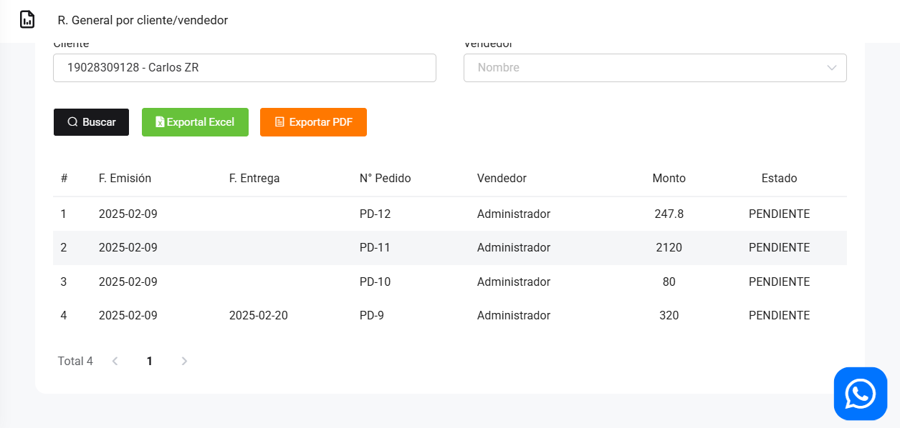

# Pedidos: General

En este artículo te ayudaremos a visualizar los pedidos realizados, y podrá exportar el reporte. Sigue estos pasos para realizarlo:

Ingresa al módulo de **Reportes** y luego en la subcategoría **Pedidos**, selecciona **General.**

 Aparecerá lo siguiente:

 Completa los siguientes filtros, deberá seleccionar el vendedor que realizo el pedido:

:::danger IMPORTANTE:
Selecciona solo los filtros que requiera.
:::

Podrá exportar los reportes, seleccionando el botón correspondiente.

Luego seleccione el botón **Buscar.** Se observa todos los pedidos generados por el vendedor y de acuerdo al periodo que selecciono.

