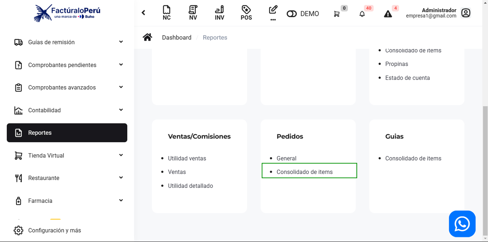
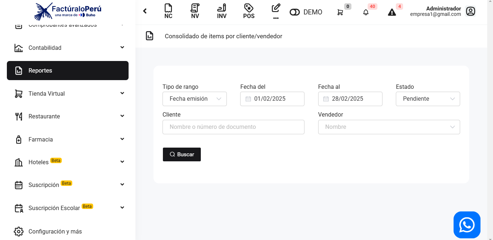
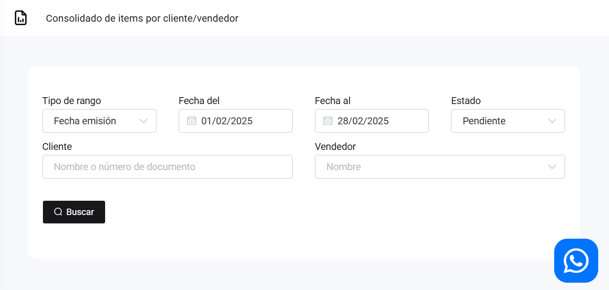
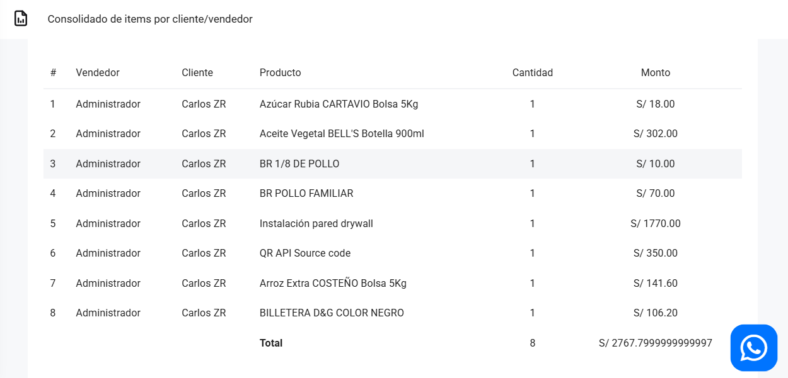

# Pedidos: Consolidado de ítems

En este artículo te mostraremos como revisar los pedidos con los productos específicos.  Sigue estos pasos para realizarlo:

Ingresa al módulo de **Reportes** y luego en la subcategoría **Pedidos**, selecciona **Consolidado de items**.

Aparecerá lo siguiente:

Completa los siguientes filtros:

:::danger IMPORTANTE:
Selecciona solo los filtros que requiera.
:::

Podrá exportar los reportes, seleccionando el botón correspondiente.

Luego seleccione el botón **Buscar.** Se observa los pedidos realizados con los productos específicos.

