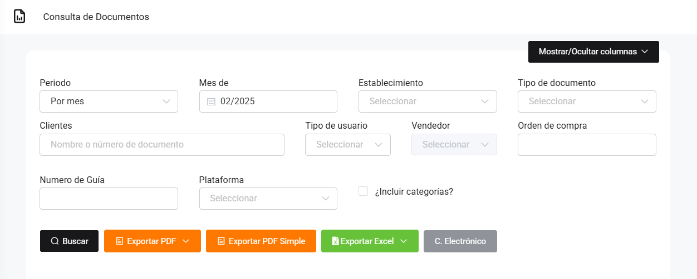
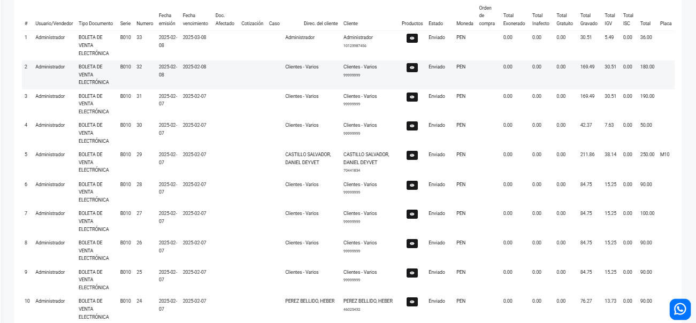

# Venta: Documentos

En este artículo te mostraremos como revisar los detalles de los siguientes documentos: Factura electrónica, Boleta de venta electrónica, Nota de crédito, Nota de débito, Nota de venta. Sigue estos pasos para realizarlo:

Ingresa al módulo de **Reportes** y luego en la subcategoría **Ventas**, selecciona **Documentos.**

Aparecerá lo siguiente:

Completa los siguientes filtros:

:::danger IMPORTANTE:

Selecciona solo los filtros que requiera. Si no seleccionas ningún tipo de documento te aparecerán todos.
:::

Podrá exportar los reportes, seleccionando el botón correspondiente.

Luego seleccione el botón **Buscar.** Se observan lo siguiente:

